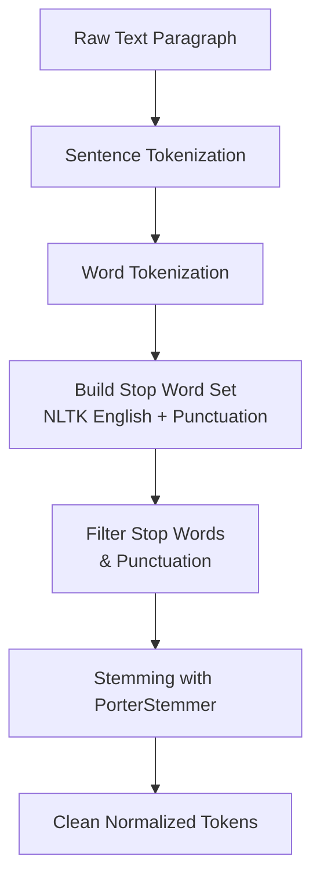

# Assignment 1: Text Preprocessing with NLTK

This assignment demonstrates fundamental **text preprocessing** techniques using the **Natural Language Toolkit (NLTK)** library. It walks through the complete pipeline of converting raw English text into normalized, machine-readable tokens: **sentence tokenization**, **word tokenization**, **stop-word removal**, and **stemming**.

---

## Table of Contents

1. [Overview](#overview)
2. [How the Pipeline Works](#how-the-pipeline-works)
3. [Flowchart](#flowchart)
4. [Key Components](#key-components)
   - [Step 1: Import Libraries & Data](#step-1-import-libraries--data)
   - [Step 2: Sentence Tokenization](#step-2-sentence-tokenization)
   - [Step 3: Word Tokenization](#step-3-word-tokenization)
   - [Step 4: Stop Words Removal](#step-4-stop-words-removal)
   - [Step 5: Stemming](#step-5-stemming)
5. [Example Output](#example-output)
6. [Frequently Asked Questions](#frequently-asked-questions)

---

## Overview

Text preprocessing is the first and most essential step in any NLP pipeline. Raw text contains noise (punctuation, common words, inflectional variants) that must be removed or normalized before feeding the data into machine learning models.

| Technique               | Description                                              | What It Does                                        |
| ----------------------- | -------------------------------------------------------- | --------------------------------------------------- |
| **Sentence Tokenization** | Splits text into individual sentences.                   | `"Hello! How are you?"` → 2 sentences               |
| **Word Tokenization**     | Splits text (or a sentence) into individual word tokens. | `"Hello, world!"` → `['Hello', ',', 'world', '!']`  |
| **Stop Words Removal**    | Filters out high-frequency, low-information words.       | Removes `'is'`, `'the'`, `'to'`, punctuation, etc.  |
| **Stemming**              | Reduces words to their root/stem form via heuristics.   | `'learning'` → `'learn'`, `'algorithms'` → `'algorithm'` |

This notebook uses the **NLTK** library (`nltk.tokenize`, `nltk.corpus`, `nltk.stem`) to perform each of these steps in sequence.

---

## How the Pipeline Works

1. A sample English paragraph is defined as a raw string.
2. The text is split into individual sentences using `sent_tokenize`.
3. The text is split into word tokens using `word_tokenize`.
4. A custom stop-word set (NLTK English stop words + punctuation) is built.
5. Stop words and punctuation are filtered out of the token list.
6. The remaining tokens are reduced to their stems using the `PorterStemmer`.

---

## Flowchart



---

## Key Components

### Step 1: Import Libraries & Data

```python
import nltk
from nltk.tokenize import sent_tokenize, word_tokenize
from nltk.corpus import stopwords
from nltk.stem import PorterStemmer
```

```python
sample_text = """
Natural language processing (NLP) is an exciting field of computer science! 
It involves teaching computers to deeply understand human languages. 
Are you currently enjoying learning about these advanced algorithms?
"""
```

The notebook imports the four core NLTK modules needed for preprocessing. NLTK data packages (`punkt`, `stopwords`) are required — the download lines are commented out in the notebook and should be uncommented or run in the console before the first execution:

```python
nltk.download('punkt')
nltk.download('stopwords')
```

> **Note:** On newer versions of NLTK (3.9+), `punkt` was renamed to `punkt_tab`. If `nltk.download('punkt')` fails, use `nltk.download('punkt_tab')` instead.

---

### Step 2: Sentence Tokenization

```python
sentences = sent_tokenize(sample_text)

print("Sentence Tokenize")
for i, sentence in enumerate(sentences):
    print(f"Sentence {1 + i} : {sentence}")
```

`sent_tokenize` uses NLTK's pre-trained Punkt tokenizer to detect sentence boundaries (periods, exclamation marks, question marks). It correctly splits the paragraph into three sentences despite the varying sentence-ending punctuation.

---

### Step 3: Word Tokenization

```python
words = word_tokenize(sample_text)

for i, word in enumerate(words):
    print(f"Words{1+i} : {word}")
```

`word_tokenize` splits the text into individual word and punctuation tokens. Punctuation marks are returned as separate tokens, which is why they must be handled in the stop-word removal step.

---

### Step 4: Stop Words Removal

```python
stop_words = set(stopwords.words('english'))
custome_words = stop_words.union({
    ',', '.', '!', '?', '(', ')'
})

filtered_words = [word for word in words if word.lower() not in custome_words]
print(filtered_words)
```

A custom stop-word set is created by combining NLTK's built-in English stop words with a set of punctuation characters. The word list is then filtered by checking (case-insensitively) whether each word appears in this set. The result is a list of content-carrying tokens only.

---

### Step 5: Stemming

```python
stemmer = PorterStemmer()
stemmed_word = [stemmer.stem(word) for word in filtered_words]
print(stemmed_word)
```

The **Porter Stemmer** is a rule-based algorithm that strips common morphological suffixes from words. It reduces inflected or derived forms to a common stem, so that words like `learning`, `learns`, and `learned` all map to `learn`. This helps reduce vocabulary size and improve model generalization.

---

## Example Output

Running the notebook on the sample text produces:

```
Original Text
Natural language processing (NLP) is an exciting field of computer science! 
It involves teaching computers to deeply understand human languages. 
Are you currently enjoying learning about these advanced algorithms?

Sentence Tokenize
Sentence 1 : Natural language processing (NLP) is an exciting field of computer science!
Sentence 2 : It involves teaching computers to deeply understand human languages.
Sentence 3 : Are you currently enjoying learning about these advanced algorithms?

After StopWords removed

['Natural', 'language', 'processing', '(', 'NLP', ')', 'exciting', 'field', 'computer', 'science', '!', 'involves', 'teaching', 'computers', 'deeply', 'understand', 'human', 'languages', 'currently', 'enjoying', 'learning', 'advanced', 'algorithms', '?']

Stemming
['natur', 'language', 'process', '(', 'nlp', ')', 'excit', 'field', 'comput', 'scienc', '!', 'involv', 'teach', 'comput', 'deep', 'understand', 'human', 'languag', 'current', 'enjoy', 'learn', 'advanc', 'algorithm', '?']
```

The pipeline successfully transforms the raw paragraph into a compact list of stemmed content tokens ready for feature extraction or modeling.

---

## Frequently Asked Questions

### 1. Why are the `nltk.download()` calls commented out?

The download lines are commented out to avoid network errors when running the notebook in environments without internet access. NLTK data only needs to be downloaded once per machine. To enable the notebook on a fresh setup, uncomment or run these commands in the console before executing the cells.

### 2. What should I do if I get a `ResourceNotFoundError` for `punkt`?

In newer NLTK versions (3.9+), the sentence and word tokenizers were split into separate packages. If `nltk.download('punkt')` does not resolve the error, switch to:

```python
nltk.download('punkt_tab')
nltk.download('stopwords')
```

### 3. Why is stemming preferred over lemmatization here?

Stemming (via the Porter Stemmer) is a fast, lightweight heuristic that chops off suffixes without consulting a dictionary. It is simpler and faster than lemmatization, making it a good default for introductory assignments. Lemmatization produces linguistically valid root words (lemmas) but is slower and requires additional resources like WordNet.

### 4. Can I add my own custom stop words?

Yes. The `custome_words` set is built with `stop_words.union(...)`, so you can add any words or symbols to the set. For example:

```python
custome_words = stop_words.union({',', '.', '!', '?', '(', ')', '"', "'", '``', "''"})
```

### 5. Why are punctuation marks included as stop words?

`word_tokenize` returns punctuation as separate tokens (e.g., `'!'`, `'('`). These carry no semantic value for most NLP tasks, so they are added to the stop-word set and removed during filtering. This ensures only meaningful word tokens remain.

### 6. How do I run the code?

The code is provided as a Jupyter notebook (`code.ipynb`). Open it in Jupyter Notebook/Lab and execute the cells in order. Alternatively, copy the code into a `.py` file and run it with Python 3 after installing NLTK and downloading the required data packages.

### 7. What is the time complexity of the Porter Stemmer?

The Porter Stemmer applies a series of ordered rules to each word. For a word of length `m`, the complexity is approximately **O(m)** per word, since each rule checks a fixed-length suffix. The overall complexity for `n` words is **O(n * m)**.
