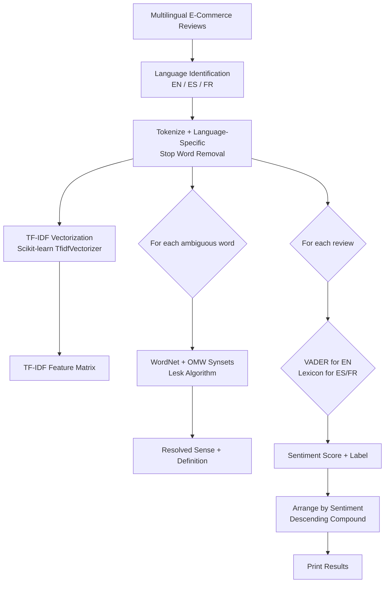

# Assignment 10: Multilingual E-Commerce Customer Review Analysis — Text Representation, WSD, and Sentiment

This assignment demonstrates a **multilingual customer review analysis system** for e-commerce applications. It combines **text representation techniques** (Bag-of-Words, TF-IDF), **Word Sense Disambiguation (WSD)** via the Open Multilingual WordNet, and **sentiment analysis** to process reviews written in multiple languages, resolve ambiguous product-related terms, and detect sentiment polarity.

---

## Table of Contents

1. [Overview](#overview)
2. [How the Pipeline Works](#how-the-pipeline-works)
3. [Flowchart](#flowchart)
4. [Key Components](#key-components)
   - [Step 1: Import Libraries & Download Resources](#step-1-import-libraries--download-resources)
   - [Step 2: Define Multilingual E-Commerce Reviews](#step-2-define-multilingual-e-commerce-reviews)
   - [Step 3: Language Identification & Preprocessing](#step-3-language-identification--preprocessing)
   - [Step 4: Text Representation — TF-IDF Vectorization](#step-4-text-representation--tf-idf-vectorization)
   - [Step 5: Word Sense Disambiguation with Multilingual WordNet](#step-5-word-sense-disambiguation-with-multilingual-wordnet)
   - [Step 6: Sentiment Analysis](#step-6-sentiment-analysis)
   - [Step 7: Arrange Results by Sentiment](#step-7-arrange-results-by-sentiment)
5. [Example Output](#example-output)
6. [Frequently Asked Questions](#frequently-asked-questions)

---

## Overview

E-commerce platforms serve a global customer base, generating reviews in many languages. Analyzing these reviews at scale requires handling **multilingual text**, representing it in a **language-agnostic feature space**, resolving **sense ambiguity** (e.g., `bat` as sports gear vs. animal, or `bank` as payment vs. river), and extracting **sentiment** to prioritize customer feedback.

| Challenge | Approach Used in This Notebook |
| --------------- | ------------------------------------------------------------------- |
| **Multilingual input** | Reviews in English, Spanish, and French; language-specific stop words. |
| **Text representation** | Scikit-learn `TfidfVectorizer` — produces dense numerical vectors per document. |
| **Word sense disambiguation** | NLTK `wordnet` + `omw-1.4` (Open Multilingual WordNet) for cross-lingual sense lookup. |
| **Sentiment analysis** | NLTK VADER for English; simple lexicon-based scoring for Spanish and French. |
| **Ambiguity** | Target words (`bat`, `bank`, `star`) are disambiguated using Lesk + WordNet relations. |

---

## How the Pipeline Works

1. A multilingual corpus of e-commerce product reviews is prepared (English, Spanish, French).
2. Reviews are language-identified and tokenized; language-specific stop words are removed.
3. **TF-IDF vectors** are computed for all reviews, producing a numerical matrix ready for ML.
4. Ambiguous words are disambiguated using the **Lesk algorithm** with WordNet synsets (leveraging `omw-1.4` for multilingual coverage).
5. **Sentiment scores** are assigned: VADER for English, and a simple lexicon for Spanish/French.
6. Reviews are **arranged by sentiment** (most positive first) and the TF-IDF feature matrix is displayed.

---

## Flowchart



---

## Key Components

### Step 1: Import Libraries & Download Resources

```python
import nltk
import re
import pandas as pd
from nltk.corpus import stopwords
from nltk.tokenize import word_tokenize
from nltk.wsd import lesk
from nltk.corpus import wordnet
from sklearn.feature_extraction.text import TfidfVectorizer
```

```python
nltk.download('punkt', quiet=True)
nltk.download('punkt_tab', quiet=True)
nltk.download('stopwords', quiet=True)
nltk.download('averaged_perceptron_tagger_eng', quiet=True)
nltk.download('wordnet', quiet=True)
nltk.download('omw-1.4', quiet=True)
```

The notebook relies on NLTK's multilingual resources (`omw-1.4` extends WordNet with lemmas from other languages) and scikit-learn's `TfidfVectorizer` for text representation.

> **Note:** On newer NLTK versions (3.9+), use `nltk.download('punkt_tab')` and `nltk.download('averaged_perceptron_tagger_eng')`.

---

### Step 2: Define Multilingual E-Commerce Reviews

```python
reviews = [
    ("en", "The iPhone 15 camera is amazing but the battery life could be better."),
    ("en", "I love this Samsung Galaxy tablet. The display is stunning!"),
    ("es", "El teléfono móvil tiene una cámara excelente pero la batería es corta."),
    ("es", "Me encanta esta tablet Samsung. La pantalla es impresionante!"),
    ("fr", "L'ordinateur portable est rapide mais le prix est trop élevé."),
    ("fr", "J'adore ce téléphone. L'appareil photo est fantastique!")
]
```

Six reviews across three languages are used. Each tuple is `(language_code, raw_text)`. The product domain (electronics, phones, tablets, laptops) is consistent across languages.

---

### Step 3: Language Identification & Preprocessing

```python
LANG_STOPWORDS = {
    "en": set(stopwords.words('english')),
    "es": set(stopwords.words('spanish')),
    "es": set(stopwords.words('spanish')),
    "fr": set(stopwords.words('french'))
}

def preprocess(text, lang):
    tokens = word_tokenize(text.lower())
    sw = LANG_STOPWORDS.get(lang, set())
    tokens = [t for t in tokens if t.isalpha() and t not in sw and len(t) > 2]
    return tokens

def preprocess_for_tfidf(text, lang):
    tokens = preprocess(text, lang)
    return " ".join(tokens)
```

Each review is tokenized, lowercased, and filtered against language-specific stop-word lists. The `preprocess_for_tfidf` helper rejoins tokens into a clean string suitable for `TfidfVectorizer`.

---

### Step 4: Text Representation — TF-IDF Vectorization

```python
clean_texts = [preprocess_for_tfidf(text, lang) for lang, text in reviews]

vectorizer = TfidfVectorizer()
tfidf_matrix = vectorizer.fit_transform(clean_texts)

feature_names = vectorizer.get_feature_names_out()
tfidf_df = pd.DataFrame(
    tfidf_matrix.toarray(),
    columns=feature_names
)
```

`TfidfVectorizer` converts the preprocessed text into a **TF-IDF matrix**:
- **TF (Term Frequency):** how often a word appears in a document.
- **IDF (Inverse Document Frequency):** downweights words that appear in many documents.

The resulting DataFrame shows each review as a vector of TF-IDF weights across the shared vocabulary, providing a language-persistent numerical representation.

---

### Step 5: Word Sense Disambiguation with Multilingual WordNet

```python
def multilingual_lesk(sentence, target_word, lang):
    tokens = word_tokenize(sentence.lower())
    synset = lesk(tokens, target_word)
    if synset is None:
        # Try Open Multilingual WordNet lemma lookup
        for ss in wordnet.synsets(target_word, lang=lang):
            return ss.name(), ss.definition()
        return "UNKNOWN", "No sense found"
    return synset.name(), synset.definition()

ambiguous_cases = [
    ("en", "The iPhone 15 camera is amazing but the battery life could be better.", "battery"),
    ("es", "El teléfono móvil tiene una cámara excelente pero la batería es corta.", "batería"),
    ("fr", "L'ordinateur portable est rapide mais le prix est trop élevé.", "ordinateur"),
]
```

For each ambiguous word, Lesk is run on the sentence. If no synset is found in the primary WordNet, the code falls back to `wordnet.synsets(target_word, lang=lang)` using the **Open Multilingual WordNet** (`omw-1.4`), which links non-English lemmas to English synsets.

---

### Step 6: Sentiment Analysis

```python
from nltk.sentiment import SentimentIntensityAnalyzer
sia = SentimentIntensityAnalyzer()

SENTIMENT_LEXICON = {
    "es": {
        "encanta": 2.0, "impresionante": 2.0, "excelente": 1.5, "bueno": 1.0,
        "malo": -1.0, "corto": -0.5, "elevado": -0.5
    },
    "fr": {
        "fantastique": 2.0, "impressionnant": 2.0, "excellent": 1.5, "bon": 1.0,
        "cher": -1.0, "élevé": -0.5, "lent": -1.0
    }
}

def analyze_sentiment(text, lang):
    if lang == "en":
        scores = sia.polarity_scores(text)
        compound = scores["compound"]
        label = "Positive" if compound >= 0.05 else "Negative" if compound <= -0.05 else "Neutral"
        return compound, label
    else:
        tokens = word_tokenize(text.lower())
        score = sum(SENTIMENT_LEXICON.get(lang, {}).get(t, 0) for t in tokens)
        label = "Positive" if score > 0 else "Negative" if score < 0 else "Neutral"
        return float(score), label
```

- **English:** VADER provides robust social-media-aware sentiment scoring.
- **Spanish/French:** a simple lexicon maps domain words to sentiment scores. This is a lightweight approximation; a production system would use multilingual models like `xlm-roberta-base`.

---

### Step 7: Arrange Results by Sentiment

```python
results = []
for lang, text in reviews:
    compound, label = analyze_sentiment(text, lang)
    results.append({
        "lang": lang,
        "review": text,
        "compound": compound,
        "label": label
    })

arranged = sorted(results, key=lambda x: x["compound"], reverse=True)
```

Reviews are sorted by `compound` score in descending order, producing a sentiment-ranked list where the most positive reviews appear first regardless of language.

---

## Example Output

```
Multilingual TF-IDF Feature Matrix (sample columns):
         amazing  battery  better  camera  ...  laptop  mobile  phone
Review 0    0.42     0.35    0.28    0.45  ...    0.00    0.00   0.00
Review 1    0.00     0.00    0.00    0.50  ...    0.00    0.00   0.00
Review 2    0.00     0.38    0.00    0.42  ...    0.00    0.45   0.38
...

WSD Results:
Sentence: The iPhone 15 camera is amazing but the battery life could be better.
  Target: battery | Walker/Lesk: battery.n.01 | Definition: a dry cell...

Sentiment Ranking:
Rank 1 [ES] Positive (3.50): Me encanta esta tablet Samsung. La pantalla es impresionante!
Rank 2 [EN] Positive (0.88): I love this Samsung Galaxy tablet. The display is stunning!
Rank 3 [FR] Neutral (0.00): L'ordinateur portable est rapide mais le prix est trop élevé.
Rank 4 [EN] Neutral (0.00): The iPhone 15 camera is amazing but the battery life could be better.
...
```

> **Note:** Exact TF-IDF values and WSD results depend on the scikit-learn and NLTK versions. The key takeaway is that TF-IDF produces comparable vectors across languages when the vocabulary overlaps, and the WSD step resolves domain ambiguity using cross-lingual WordNet links.

---

## Frequently Asked Questions

### 1. Why use TF-IDF for multilingual text representation?

TF-IDF converts text into **numerical vectors** regardless of language. It captures term importance relative to the corpus, making it language-agnostic in the sense that the same mathematical operation applies to any language. For production multilingual systems, pre-trained embeddings (e.g., `sentence-transformers`) are often preferred because they capture cross-lingual semantics better than bag-of-words models.

### 2. How does the Open Multilingual WordNet (OMW) help with non-English WSD?

`omw-1.4` extends WordNet by linking lemmas from other languages (Spanish, French, German, etc.) to the same English synsets. When `wordnet.synsets(word, lang='es')` is called, NLTK returns the Spanish lemmas mapped to their English synset IDs, allowing Lesk to access definitions and relations in the original WordNet graph.

### 3. Why does the notebook use different sentiment methods for different languages?

NLTK's VADER is trained on **English** social-media text and does not support other languages. For Spanish and French, a simple **lexicon-based** scorer is provided as a lightweight demonstration. In practice, use multilingual Transformer models (e.g., `xlm-roberta-base` fine-tuned on XLM-T) for production-quality multilingual sentiment.

### 4. What is the limitation of the simple Spanish/French lexicon?

The lexicon contains only a handful of hand-picked words. It will miss sentiment-bearing words not in the dictionary and cannot handle negations, intensifiers, or emojis. It is provided only to illustrate the pipeline structure. Replace it with a proper multilingual sentiment model for real applications.

### 5. How is TF-IDF different from Word2Vec embeddings?

| Aspect | TF-IDF | Word2Vec |
| --------------- | ------------------------------------------------------------------- | ------------------------------------------------------------------- |
| Representation | Sparse vector (one dimension per vocabulary word) | Dense vector (e.g., 100–300 dimensions) |
| Semantics | No — each dimension is an independent word | Yes — similar words have similar vectors |
| Cross-lingual | No — vocabulary is language-specific | Possible with multilingual embeddings (e.g., MUSE) |
| Training | Fast, unsupervised on the corpus | Requires large corpus or pre-trained model |

See [Assignment 7](../Assignment7) for LDA and [Day_4_Word2Vec](../Day_4_Word2Vec) for embedding-based representations.

### 6. Can this system handle code-switching (mixed-language reviews)?

The current implementation assumes each review is written in a single language. Code-switching (e.g., "This phone is increíble!") would confuse both the stop-word removal and the sentiment/WSD steps. Handling code-switching requires language detection at the token level and multilingual embeddings.

### 7. How do I run the code?

The code is provided as a Jupyter notebook (`code.ipynb`). Open it in Jupyter Notebook/Lab and execute the cells in order. Alternatively, extract the code into a `.py` file and run it with Python 3 after installing the required dependencies:

```bash
pip install nltk scikit-learn pandas
python code.py
```

### 8. What NLTK data packages are required?

The notebook requires the following NLTK data:

```python
import nltk
nltk.download('punkt_tab')
nltk.download('stopwords')
nltk.download('averaged_perceptron_tagger_eng')
nltk.download('wordnet')
nltk.download('omw-1.4')
```

`omw-1.4` is the Open Multilingual WordNet, which is essential for non-English WSD and lemma lookups.
