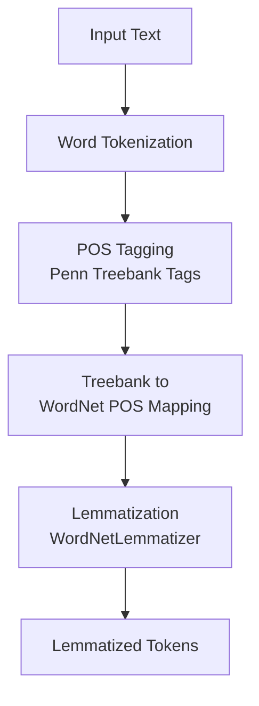

# Assignment 2: POS Tagging & Lemmatization with NLTK

This assignment demonstrates **Parts-of-Speech (POS) tagging** and **lemmatization** using the **Natural Language Toolkit (NLTK)** library. It extends basic text preprocessing by assigning grammatical labels to each token and then reducing words to their dictionary base forms (lemmas) based on those labels.

---

## Table of Contents

1. [Overview](#overview)
2. [How the Pipeline Works](#how-the-pipeline-works)
3. [Flowchart](#flowchart)
4. [Key Components](#key-components)
   - [Step 1: Import Libraries & Input Text](#step-1-import-libraries--input-text)
   - [Step 2: Word Tokenization](#step-2-word-tokenization)
   - [Step 3: POS Tagging](#step-3-pos-tagging)
   - [Step 4: Treebank to WordNet POS Mapping](#step-4-treebank-to-wordnet-pos-mapping)
   - [Step 5: Lemmatization](#step-5-lemmatization)
5. [Example Output](#example-output)
6. [Frequently Asked Questions](#frequently-asked-questions)

---

## Overview

After raw text is tokenized (as covered in [Assignment 1](../Assignment1)), the next critical preprocessing steps are **POS tagging** and **lemmatization**. These provide grammatical and morphological context that significantly improves downstream NLP tasks such as feature extraction, sentiment analysis, and machine translation.

| Technique           | Description                                              | What It Does                                        |
| ------------------- | -------------------------------------------------------- | --------------------------------------------------- |
| **POS Tagging**     | Assigns a grammatical label (e.g., noun, verb) to each token. | `'foxes'` → `NNS` (plural noun), `'actively'` → `RB` (adverb) |
| **Lemmatization**   | Reduces a word to its dictionary base form (lemma) using POS context. | `'foxes'` → `'fox'`, `'jumping'` → `'jump'`         |

This notebook uses NLTK's `pos_tag` (based on the Penn Treebank tagset) to label tokens, then maps those tags to WordNet's POS categories so the `WordNetLemmatizer` can correctly lemmatize each word.

---

## How the Pipeline Works

1. A sample English sentence is defined as a string.
2. The sentence is split into word tokens using `word_tokenize`.
3. Each token is tagged with a Penn Treebank POS tag using `pos_tag`.
4. A helper function converts Treebank tags (e.g., `NNS`, `VBG`) into WordNet POS constants (e.g., `wordnet.NOUN`, `wordnet.VERB`).
5. The `WordNetLemmatizer` uses the mapped POS to compute the lemma for each word.

---

## Flowchart



---

## Key Components

### Step 1: Import Libraries & Input Text

```python
import nltk
import nltk.data
from nltk.tokenize import sent_tokenize, word_tokenize
from nltk.tag import pos_tag
from nltk.stem import WordNetLemmatizer
from nltk.corpus import wordnet
```

```python
text = "The quick brown foxes are actively jumping over the lazy dogs."
print(f"Original Text : {text}")
words = word_tokenize(text=text)
print(words)
```

The notebook imports the core NLTK modules for tokenization (`word_tokenize`), tagging (`pos_tag`), and lemmatization (`WordNetLemmatizer`, `wordnet`). The required NLTK data packages must be downloaded before running:

```python
nltk.download('punkt')
nltk.download('punkt_tab')
nltk.download('averaged_perceptron_tagger')
nltk.download('wordnet')
nltk.download('omw-1.4')
```

> **Note:** On newer NLTK versions (3.9+), use `nltk.download('punkt_tab')` and `nltk.download('averaged_perceptron_tagger_eng')` instead of the older package names.

---

### Step 2: Word Tokenization

```python
words = word_tokenize(text=text)
print(words)
```

The input sentence is split into a list of word and punctuation tokens. This flat token list is the input to both the POS tagger and the lemmatizer.

---

### Step 3: POS Tagging

```python
pos_tags = pos_tag(words)
print("POS Tagging Output")
for word, tag in pos_tags:
    print(f"{word:<10} -> {tag}")
```

`pos_tag` assigns each token a **Penn Treebank** part-of-speech tag. For example, `foxes` is tagged as `NNS` (plural noun) and `jumping` as `VBG` (verb, gerund/present participle). These tags are essential because lemmatization behaves differently depending on whether a word is a noun, verb, adjective, or adverb.

---

### Step 4: Treebank to WordNet POS Mapping

```python
def get_wordnet_pos(treebank_tag):
    if treebank_tag.startswith('J'):
        return wordnet.ADJ
    elif treebank_tag.startswith('V'):
        return wordnet.VERB
    elif treebank_tag.startswith('N'):
        return wordnet.NOUN
    elif treebank_tag.startswith('R'):
        return wordnet.ADV
    else:
        return wordnet.NOUN
```

NLTK's `pos_tag` returns Penn Treebank tags, but `WordNetLemmatizer` expects WordNet POS constants (`wordnet.NOUN`, `wordnet.VERB`, etc.). This helper function bridges the gap by mapping each Treebank tag prefix to the corresponding WordNet category:

| Treebank Prefix | WordNet POS | Tag Examples   |
| ------------------------------ | ----------------- | --------------------- |
| `J`             | `wordnet.ADJ`  | `JJ`, `JJR`, `JJS` |
| `V`             | `wordnet.VERB` | `VB`, `VBD`, `VBG`, `VBN`, `VBP`, `VBZ` |
| `N`             | `wordnet.NOUN` | `NN`, `NNS`, `NNP`, `NNPS` |
| `R`             | `wordnet.ADV`  | `RB`, `RBR`, `RBS` |
| other           | `wordnet.NOUN` | (default fallback) |

For tags that don't match (e.g., `DT` for determiners like `'the'`), the function defaults to `wordnet.NOUN`.

---

### Step 5: Lemmatization

```python
lemmitizer = WordNetLemmatizer()
lemmatized_word = []

for word, tag in pos_tags:
    w_pos = get_wordnet_pos(tag)
    lemma = lemmitizer.lemmatize(word, pos=w_pos)
    lemmatized_word.append(lemma)

print("Lemmatized Output")
print(lemmatized_word)
```

The `WordNetLemmatizer` reduces each word to its base form (lemma) using the POS tag as context. Unlike stemming, lemmatization consults a dictionary (WordNet) and always returns valid words. For example, `foxes` → `fox` and `dogs` → `dog`, whereas without POS context, `is` might not lemmatize correctly to `be`.

---

## Example Output

Running the notebook on the input sentence produces:

```
Original Text : The quick brown foxes are actively jumping over the lazy dogs.
['The', 'quick', 'brown', 'foxes', 'are', 'actively', 'jumping', 'over', 'the', 'lazy', 'dogs', '.']

POS Tagging Output
The          -> DT
quick        -> JJ
brown        -> NN
foxes        -> NNS
are          -> VBP
actively     -> RB
jumping      -> VBG
over         -> IN
the          -> DT
lazy         -> JJ
dogs         -> NNS
.            -> .

Lemmatized Output
['The', 'quick', 'brown', 'fox', 'be', 'actively', 'jump', 'over', 'the', 'lazy', 'dog', '.']
```

The pipeline transforms the raw sentence into a list of lemmas where inflected words are normalized to their dictionary forms (e.g., `foxes` → `fox`, `are` → `be`, `jumping` → `jump`, `dogs` → `dog`).

---

## Frequently Asked Questions

### 1. Why is POS tagging necessary before lemmatization?

Lemmatization is **context-sensitive**: the correct base form of a word depends on its part of speech. For example, `better` is the comparative form of `good` (adjective) but is unrelated to `better` as a noun. With the `WordNetLemmatizer`, passing the correct POS (`wordnet.ADJ`) ensures `better` → `good`. Without it, the lemmatizer defaults to treating the word as a noun and may not reduce it correctly.

### 2. What is the difference between stemming and lemmatization?

| Aspect          | Stemming                  | Lemmatization             |
| --------------- | ------------------------- | ------------------------- |
| Approach        | Rule-based suffix stripping | Dictionary-based lookup   |
| Output          | Stems (not always valid words) | Lemmas (valid words)      |
| Speed           | Fast                      | Slower (requires WordNet) |
| Accuracy        | Approximate               | More precise              |

See [Assignment 1](../Assignment1) for a stemming example with the Porter Stemmer.

### 3. What are Penn Treebank tags?

Penn Treebank tags are a standardized set of POS labels used in computational linguistics. Examples include `NN` (noun, singular), `NNS` (noun, plural), `VB` (verb, base form), `VBG` (verb, gerund), `JJ` (adjective), and `RB` (adverb). NLTK's `pos_tag` uses the Penn Treebank tagset by default.

### 4. What happens when a word is already at its base form?

The lemmatizer simply returns the word unchanged. For example, `quick` (an adjective) is already a lemma, so it remains `quick`. Punctuation and determiners (like `The` and `.`) are returned as-is since they have no meaningful lemma.

### 5. Can I lemmatize without POS tags?

Yes, but the `WordNetLemmatizer` defaults to `wordnet.NOUN` when no POS is specified. This means verbs like `jumping` would be treated as nouns and would not be reduced to `jump`. Always pass the POS for best results.

### 6. How do I run the code?

The code is provided as a Jupyter notebook (`code.ipynb`). Open it in Jupyter Notebook/Lab and execute the cells in order. Alternatively, copy the code into a `.py` file and run it with Python 3 after installing NLTK and downloading the required data packages.

### 7. What NLTK data packages are required?

The notebook requires the following NLTK data: `punkt` (or `punkt_tab`), `averaged_perceptron_tagger` (or `averaged_perceptron_tagger_eng`), `wordnet`, and `omw-1.4`. Download them with:

```python
import nltk
nltk.download('punkt_tab')
nltk.download('averaged_perceptron_tagger_eng')
nltk.download('wordnet')
nltk.download('omw-1.4')
```
