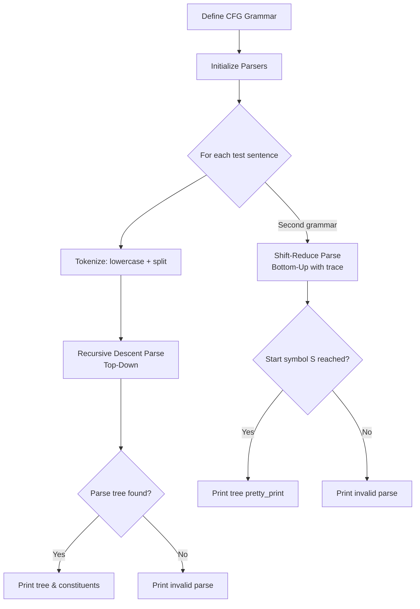

# Assignment 3: Syntactic Parsing with CFG — Recursive Descent & Shift-Reduce

This assignment demonstrates **syntactic parsing** using **Context-Free Grammars (CFG)** in NLTK. It compares two classic parsing strategies — **Recursive Descent** (top-down) and **Shift-Reduce** (bottom-up) — to determine whether a sentence can be derived from a given grammar and to visualize the resulting parse trees.

---

## Table of Contents

1. [Overview](#overview)
2. [How the Pipeline Works](#how-the-pipeline-works)
3. [Flowchart](#flowchart)
4. [Key Components](#key-components)
   - [Step 1: Import Libraries](#step-1-import-libraries)
   - [Step 2: Define the Context-Free Grammar](#step-2-define-the-context-free-grammar)
   - [Step 3: Initialize the Parsers](#step-3-initialize-the-parsers)
   - [Step 4: Bottom-Up Parsing with Recursive Descent](#step-4-bottom-up-parsing-with-recursive-descent)
   - [Step 5: Top-Down Parsing — Tree Breakdown](#step-5-top-down-parsing--tree-breakdown)
   - [Step 6: Syntactic Analysis Function](#step-6-syntactic-analysis-function)
   - [Step 7: Execution](#step-7-execution)
5. [Example Output](#example-output)
6. [Frequently Asked Questions](#frequently-asked-questions)

---

## Overview

Parsing is the process of assigning a **syntactic structure** (a tree) to a sentence based on a set of grammatical rules. This assignment explores two complementary approaches to CFG parsing:

| Parser Type       | Description                                              | Direction |
| ----------------- | -------------------------------------------------------- | --------- |
| **Recursive Descent** | Backtracks through grammar rules to find a valid derivation. | Top-Down  |
| **Shift-Reduce**      | Builds the tree bottom-up by shifting tokens and reducing constituents. | Bottom-Up |

The notebook defines a grammar, runs multiple test sentences through both parsers, prints bracketed and tree representations, and exposes a reusable `perform_syntactic_analysis` function that applies both strategies to an arbitrary input.

---

## How the Pipeline Works

1. A **Context-Free Grammar (CFG)** is defined using `nltk.CFG.fromstring`, specifying production rules for `S`, `NP`, `VP`, `PP`, and terminal categories (`Det`, `Adj`, `N`, `V`, `Adv`, `P`).
2. A **RecursiveDescentParser** is initialized from the grammar.
3. A set of test sentences is defined.
4. Each sentence is tokenized (lowercased, split on whitespace) and parsed using Recursive Descent.
5. For sentences with valid parses, the tree structure and constituent breakdowns are printed.
6. A second, simpler grammar and a `perform_syntactic_analysis` function demonstrate a combined top-down (Recursive Descent) + bottom-up (Shift-Reduce) analysis with visual tree output.

---

## Flowchart



---

## Key Components

### Step 1: Import Libraries

```python
import nltk
from nltk.parse import RecursiveDescentParser, EarleyChartParser
from nltk import CFG, Nonterminal
from nltk.tree import Tree
```

The notebook imports NLTK's CFG module, tree-based parsers, and the `Tree` data structure for representing and traversing parse trees.

---

### Step 2: Define the Context-Free Grammar

```python
grammar = CFG.fromstring("""
S -> NP VP
S -> NP VP PP
NP -> Det N
NP -> Det Adj N
VP -> V NP
VP -> V NP PP
VP -> V Adj
PP -> P NP
Det -> "the" | "a"
Adj -> "big" | "small" | "red" | "quick"
N -> "dog" | "cat" | "rug" | "man" | "park"
V -> "chased" | "sat" | "walked" | "saw"
Adv -> "quickly" | "slowly"
P -> "in" | "on" | "by" | "with"
""")
```

A **Context-Free Grammar** defines the syntactic structure of the language. It contains:

- **Non-terminals:** `S` (sentence), `NP` (noun phrase), `VP` (verb phrase), `PP` (prepositional phrase)
- **Lexical categories:** `Det` (determiner), `Adj` (adjective), `N` (noun), `V` (verb), `Adv` (adverb), `P` (preposition)
- **Production rules:** specify how each non-terminal can be expanded

This grammar supports sentences like `"the quick dog saw a red cat"` and `"the big dog sat on the red rug"`.

---

### Step 3: Initialize the Parsers

```python
rd = RecursiveDescentParser(grammar)
```

The `RecursiveDescentParser` performs **top-down** parsing: it starts from the start symbol `S` and recursively attempts to expand non-terminals until it matches the input tokens. It uses backtracking to explore alternative derivations when a path fails.

---

### Step 4: Bottom-Up Parsing with Recursive Descent

```python
sentences = [
    "the dog chased the cat",
    "the quick dog saw a red cat",
    "the big dog sat on the red rug"
]

for sent in sentences:
    tokens = sent.lower().split()
    print(f"Sentence : {sent}")
    print("=" * 60)
    found = True
    for tree in rd.parse(tokens):
        found = True
        print(tree.pformat())

    if not found:
        print("not a valid parse")
```

Each test sentence is tokenized and fed to the Recursive Descent parser. The `pformat()` method outputs the parse tree in **bracket notation** (e.g., `(S (NP (Det the) (N dog)) ...)`). If no valid derivation exists, the sentence is reported as invalid.

---

### Step 5: Top-Down Parsing — Tree Breakdown

```python
for sent in sentences:
    tokens = sent.lower().split()
    print(f"Shift-Reduce Parse : {sent}")
    print("=" * 60)
    found = False
    for tree in rd.parse(tokens):
        found = True
        print(tree.pformat())
        print(tree.label())
        for subtree in tree:
            if isinstance(subtree, Tree):
                print(f" {subtree.label()} -> {[leaf for leaf in subtree.leaves()]}")

    if not found:
        print("parse not found")
```

This loop provides a **constituent breakdown** of each parse tree. For each subtree, it prints the constituent label and the list of leaf words it contains, making the sentence structure transparent at a glance.

---

### Step 6: Syntactic Analysis Function

```python
def perform_syntactic_analysis(text):
    print(f"Analyzing Text: '{text}'")
    print("=" * 40)

    tokens = text.lower().split()
    print(f"Tokens: {tokens}\n")

    print("--- TOP-DOWN PARSER RESULTS ---")
    rd_parser = nltk.RecursiveDescentParser(grammar)

    td_success = False
    for tree in rd_parser.parse(tokens):
        tree.pretty_print()
        td_success = True

    if not td_success:
        print("[INVALID] Top-Down Parser could not form a valid syntax tree.\n")

    print("\n--- BOTTOM-UP PARSER RESULTS ---")
    sr_parser = nltk.ShiftReduceParser(grammar, trace=2)

    bu_success = False
    for tree in sr_parser.parse(tokens):
        print("\nFinal Parse Tree:")
        tree.pretty_print()
        bu_success = True

    if not bu_success:
        print("\n[INVALID] Bottom-Up Parser could not reduce to Start Symbol (S).")
```

This reusable function applies **both** parsing strategies to a given input:

1. **Top-down (Recursive Descent):** attempts to build the tree from the root `S` down to the leaves (words).
2. **Bottom-up (Shift-Reduce):** uses a stack-based approach with `trace=2` to show shift/reduce operations, building the tree from leaves up to the root.

The `pretty_print()` method renders a visual ASCII tree.

---

### Step 7: Execution

```python
if __name__ == "__main__":
    test_text = "the dog chased a cat"
    perform_syntactic_analysis(test_text)
```

The function is called with the test sentence `"the dog chased a cat"`, which is valid under the simpler grammar:

```python
S -> NP VP
NP -> Det N | N
VP -> V NP | V
Det -> 'the' | 'a'
N -> 'dog' | 'cat' | 'mouse'
V -> 'chased' | 'saw' | 'bitten'
```

---

## Example Output

```
Analyzing Text: 'the dog chased a cat'
========================================
Tokens: ['the', 'dog', 'chased', 'a', 'cat']

--- TOP-DOWN PARSER RESULTS ---
         S
    ┌────┴────┐
    │         VP
    │    ┌────┴────┐
   NP     V        NP
    │     │    ┌───┴───┐
   Det    N    Det    N
    │     │    │     │
   the   dog chased   a  cat

--- BOTTOM-UP PARSER RESULTS ---
... (shift/reduce trace output) ...

Final Parse Tree:
         S
    ┌────┴────┐
    │         VP
    │    ┌────┴────┐
   NP     V        NP
    │     │    ┌───┴───┐
   Det    N    Det    N
    │     │    │     │
   the   dog chased   a  cat
```

The parse tree shows the sentence structure: `S → NP VP`, where `NP → Det N` ("the dog") and `VP → V NP` ("chased a cat").

---

## Frequently Asked Questions

### 1. What is the difference between top-down and bottom-up parsing?

| Parser          | Strategy                              | How It Works                                       |
| --------------- | ------------------------------------- | -------------------------------------------------- |
| **Recursive Descent (Top-Down)** | Starts from the start symbol `S` and expands non-terminals to match input tokens. | Tries each production rule via depth-first search with backtracking. |
| **Shift-Reduce (Bottom-Up)** | Starts from the input tokens and builds up to the start symbol `S`. | Uses a stack: shifts tokens from input, reduces constituents when a rule's RHS is on top of the stack. |

### 2. What is a Context-Free Grammar (CFG)?

A **CFG** is a set of production rules where each rule has a single non-terminal on the left-hand side and a sequence of terminals/non-terminals on the right. It defines the valid syntactic structures of a language. NLTK's `CFG.fromstring` parses a string representation into a grammar object.

### 3. Why might a parser return no valid parse tree?

A sentence will not parse if it contains words or structures not covered by the grammar. For example, `"the quickly dog chased the cat"` would fail because `quickly` (an adverb) is not allowed in the `NP` position — the grammar has no rule like `Adv -> 'quickly'` within `NP`.

### 4. What does `trace=2` do in the Shift-Reduce Parser?

The `trace` parameter controls the verbosity of the parser's debug output. `trace=2` prints each **shift** and **reduce** operation with the current stack contents, allowing you to follow exactly how the parser builds the tree step by step.

### 5. Can both parsers handle ambiguous grammars?

Yes. If a sentence has multiple valid parse trees, both parsers will return **all** of them. The notebooks iterate over `parser.parse(tokens)` with a `for` loop, which yields each valid tree.

### 6. How do I run the code?

The code is provided as a Jupyter notebook (`Code.ipynb`). Open it in Jupyter Notebook/Lab and execute the cells in order. Alternatively, extract the code into a `.py` file and run it with Python 3 after installing NLTK:

```bash
pip install nltk
python code.py
```

### 7. What NLTK data is required?

Parsing with NLTK CFGs is self-contained — no external corpora or models are needed. The grammar and parsers are built entirely from the rules defined in the notebook. For visualization via `pretty_print()`, only a standard terminal or Jupyter environment is needed.
