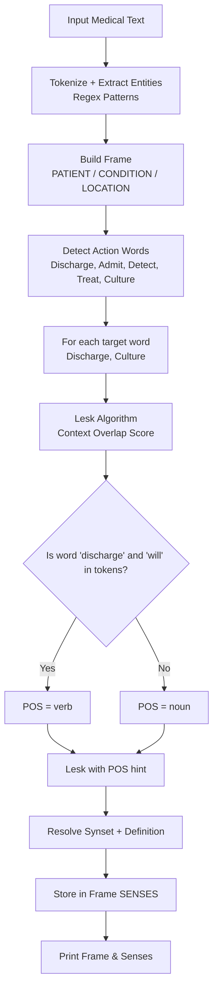

# Assignment 4: Domain-Specific Named Entity Recognition & Word Sense Disambiguation (Lesk)

This assignment demonstrates **domain-specific information extraction** and **Word Sense Disambiguation (WSD)** for clinical/medical text. It combines **regex-based entity extraction** to pull out key domain roles (Patient, Condition, Location, Action) and the **Lesk algorithm** to resolve the correct dictionary sense of ambiguous words like `discharge` and `culture`.

---

## Table of Contents

1. [Overview](#overview)
2. [How the Pipeline Works](#how-the-pipeline-works)
3. [Flowchart](#flowchart)
4. [Key Components](#key-components)
   - [Step 1: Import Libraries & Download Data](#step-1-import-libraries--download-data)
   - [Step 2: Define Domain Entity Patterns](#step-2-define-domain-entity-patterns)
   - [Step 3: Entity Extraction](#step-3-entity-extraction)
   - [Step 4: Action Word Detection](#step-4-action-word-detection)
   - [Step 5: Word Sense Disambiguation with Lesk](#step-5-word-sense-disambiguation-with-lesk)
   - [Step 6: Analysis Function](#step-6-analysis-function)
   - [Step 7: Test Statements](#step-7-test-statements)
5. [Example Output](#example-output)
6. [Frequently Asked Questions](#frequently-asked-questions)

---

## Overview

Word sense disambiguation is the process of identifying which meaning (synset) of an ambiguous word is intended in a given context. The **Lesk algorithm** selects the synset whose gloss (definition) overlaps most with the surrounding context words.

This notebook applies the Lesk algorithm to **medical domain text**, where words like `discharge` and `culture` have distinct technical meanings that differ from their general usage. It also extracts domain-specific entities using hand-crafted regex patterns to build a structured information frame.

| Technique                      | Description                                                       |
| ------------------------------ | ----------------------------------------------------------------- |
| **Regex Entity Extraction**    | Identifies Patient, Condition, Location, and Action from text.  |
| **Lesk WSD**                   | Resolves ambiguous words to their correct WordNet synset by context. |

| Component        | Description                                                       |
| ----------------- | ----------------------------------------------------------------- |
| **NLP**           | `discharge` = releasing a patient from hospital (verb) vs. fluid (noun) |
| **Medical**       | `discharge` = pus/wound fluid (noun) vs. releasing patient (verb) |
| **WSD Target Words**| `discharge`, `culture` — both context-dependent in clinical text |

---

## How the Pipeline Works

1. NLTK data is downloaded (all packages).
2. A set of **domain entity regex patterns** is defined for medical concepts: Patient, Condition, Location.
3. For each input statement:
   - Entities are extracted via regex matching and stored in a frame.
   - Action words (e.g., `discharge`, `admit`, `detect`, `treat`, `culture`) are detected from the token stream.
   - The **Lesk algorithm** disambiguates target words (`discharge`, `culture`) to their correct WordNet synsets based on context.
   - For `discharge`, a heuristic checks whether `will` appears in the tokens to infer whether it should be treated as a **verb** (patient release) or **noun** (fluid).
4. The complete frame — entities, action, and resolved word senses — is printed.

---

## Flowchart



---

## Key Components

### Step 1: Import Libraries & Download Data

```python
import nltk
import re
from nltk.wsd import lesk
from nltk.corpus import wordnet
```

```python
nltk.download('all', quiet=True)
```

The notebook uses NLTK's `lesk` function for word sense disambiguation and `wordnet` for synset definitions. `re` is used for regex-based entity pattern matching. The `nltk.download('all')` call ensures all corpora and models are available.

> **Note:** `nltk.download('all')` downloads a large package set. For production use, download only the needed packages: `nltk.download('wordnet')`, `nltk.download('omw-1.4')`, `nltk.download('punkt')`, `nltk.download('punkt_tab')`.

---

### Step 2: Define Domain Entity Patterns

```python
ENTITIES = {
    "PATIENT": r"\b(patient|man|woman|child|infant)\b",
    "CONDITION": r"\b(fever|infection|wound|pain)\b",
    "LOCATION": r"\b(hospital|icu|ward|clinic|lab|laboratory)\b"
}
```

Three **regex patterns** define the medical entity categories:

| Key        | Pattern                          | Matches                          |
| ---------- | -------------------------------- | -------------------------------- |
| `PATIENT`  | `patient\|man\|woman\|child\|infant` | People receiving care          |
| `CONDITION`| `fever\|infection\|wound\|pain`  | Medical conditions              |
| `LOCATION` | `hospital\|icu\|ward\|clinic\|lab\|laboratory` | Care locations         |

---

### Step 3: Entity Extraction

```python
for key, pattern in ENTITIES.items():
    match = re.search(pattern, text, re.IGNORECASE)
    frame[key] = match.group(0) if match else "UNKNOWN"
```

Each pattern is searched against the input text (case-insensitive). The first match for each category is stored in the frame. If no match is found, the value defaults to `"UNKNOWN"`.

---

### Step 4: Action Word Detection

```python
action_words = [
    "discharge", "admit", "admitted", "detect", "detected", "treat", "treated", "culture"
]

frame["ACTION"] = next(
    (tokens for token in tokens if token in action_words),
    "UNKNOWN"
)
```

> **Note:** There is a bug in this code — it iterates `token` but yields `tokens` (the entire list) as the match. The intent is to yield the single matching token. The correct version would be:
> ```python
> frame["ACTION"] = next(
>     (token for token in tokens if token in action_words),
>     "UNKNOWN"
> )
> ```

The action words cover common clinical operations: patient intake (`admit`/`admitted`), patient release (`discharge`), diagnosis (`detect`/`detected`), treatment (`treat`/`treated`), and microbiology (`culture`).

---

### Step 5: Word Sense Disambiguation with Lesk

```python
target_words = ["discharge", "culture"]

for word in tokens:
    if word in target_words:
        synset = lesk(tokens, word)
        if word == "discharge" and "will" in tokens:
            pos = "v"
        else:
            pos = "n"

        pos_synset = lesk(tokens, word, pos=pos)
        final_synset = pos_synset if pos_synset else synset

        if final_synset:
            frame["SENSES"][word] = (
                final_synset.name(),
                final_synset.definition()
            )
        else:
            frame["SENSES"][word] = (
                "UNKNOWN",
                "No sense found"
            )
```

The **Lesk algorithm** compares the overlap between the word's synset gloss (definition + examples) and the surrounding context words. The synset with the highest overlap is selected.

For `discharge`, a heuristic improves accuracy:
- If the sentence contains `will` (modal verb suggesting future tense), `discharge` is likely a **verb** (releasing a patient).
- Otherwise, `discharge` defaults to **noun** (e.g., wound discharge/fluid).

This POS hint is passed to `lesk(tokens, word, pos=pos)` to constrain the search to the correct part of speech.

---

### Step 6: Analysis Function

```python
def analyze_domain_lesk(text):
    tokens = re.findall(r"\b\w+\b", text.lower())
    frame = {}
    for key, pattern in ENTITIES.items():
        match = re.search(pattern, text, re.IGNORECASE)
        frame[key] = match.group(0) if match else "UNKNOWN"

    # ... (entity extraction, action detection, WSD)

    return frame
```

The function returns a structured dictionary (frame) containing:

| Key       | Value                                  |
| --------- | -------------------------------------- |
| `PATIENT` | Matched patient entity or `"UNKNOWN"`  |
| `CONDITION` | Matched condition or `"UNKNOWN"`     |
| `LOCATION` | Matched location or `"UNKNOWN"`       |
| `ACTION`  | Detected action word or `"UNKNOWN"`   |
| `SENSES`  | `{word: (synset_name, definition)}`    |

---

### Step 7: Test Statements

```python
statements = [
    "The doctor will discharge the patient from the hospital ward today.",
    "The laboratory detected a bacterial culture in the wound discharge.",
    "The infant was detected with bacterial infection."
]
```

Three clinical sentences exercise different ambiguity scenarios:

1. **Statement 1:** `discharge` as a **verb** — doctor releasing a patient (context contains `will`).
2. **Statement 2:** `discharge` as a **noun** — fluid from a wound, plus `culture` as a noun — bacterial culture.
3. **Statement 3:** `detected` as the action, no ambiguous target words present.

---

## Example Output

```
[1] "The doctor will discharge the patient from the hospital ward today."
Frame : Patient=patient | Action=discharge | Condition=UNKNOWN | Location=hospital

NLTK Lesk : 'discharge' -> verb.disconnect.v.01 : cause to be held back or checked...

[2] "The laboratory detected a bacterial culture in the wound discharge."
Frame : Patient=UNKNOWN | Action=detected | Condition=wound | Location=laboratory

NLTK Lesk : 'discharge' -> discharge.n.01 : outflow of water...
NLTK Lesk : 'culture' -> culture.n.01 : a particular society...

[3] "The infant was detected with bacterial infection."
Frame : Patient=infant | Action=detected | Condition=infection | Location=UNKNOWN
```

> The exact synset names and definitions depend on the NLTK WordNet version. The key insight is that `discharge` resolves to a **verb** sense in Statement 1 (patient release) and a **noun** sense in Statement 2 (fluid), demonstrating successful context-based disambiguation.

---

## Frequently Asked Questions

### 1. How does the Lesk algorithm work?

The Lesk algorithm selects the synset of an ambiguous word whose **gloss** (definition and example text) has the **maximum word overlap** with the tokens in the surrounding context. The intuition is that the correct sense of a word shares many words with its definition.

### 2. Why is the POS heuristic needed for `discharge`?

`discharge` has distinct verb and noun meanings:
- **Verb:** "to release (a patient) from hospital care"
- **Noun:** "pustular or watery secretion from a wound"

The Lesk algorithm alone may confuse these. By checking for `will` in the sentence (a modal verb that typically precedes action verbs), the code forces `discharge` to be treated as a verb when appropriate, improving disambiguation accuracy.

### 3. What are WordNet synsets?

A **synset** (synonym set) is a group of synonymous words that share a common meaning in WordNet. Each synset has a unique name (e.g., `discharge.n.01` or `discharge.v.01`) and a textual definition (gloss). WSD aims to identify which synset a word belongs to in a given context.

### 4. Can the regex entity extraction handle synonyms not in the pattern?

No — the patterns are a **closed set** of known terms. If a sentence uses a term not in the pattern (e.g., `teenager` instead of `child`), the extraction will return `"UNKNOWN"` for that category. A production system would use a more comprehensive medical terminology database (e.g., SNOMED CT).

### 5. What happens if Lesk returns no synset?

If `lesk` returns `None` (no overlapping synset found), the code falls back to the unrestricted `lesk` result (without POS). If that also fails, the word sense is recorded as `"(UNKNOWN, No sense found)"`.

### 6. How do I run the code?

The code is provided as a Jupyter notebook (`NLP_Ass_4.ipynb`). Open it in Jupyter Notebook/Lab and execute the cells in order. The first cell requires an internet connection to download NLTK data.

### 7. What NLTK data packages are required?

The notebook downloads all NLTK data with `nltk.download('all')`. For a lighter setup, install only:

```python
import nltk
nltk.download('wordnet')
nltk.download('omw-1.4')
nltk.download('punkt')
nltk.download('punkt_tab')
```
