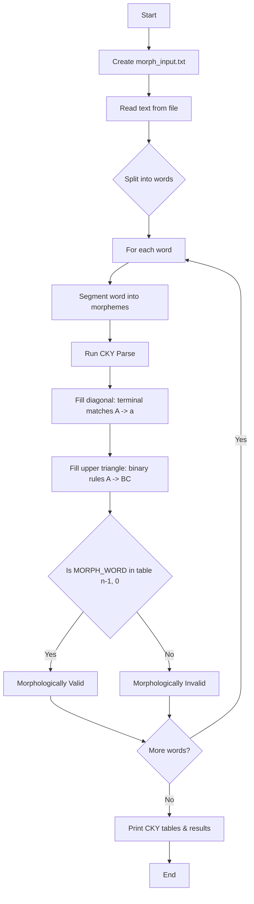

# Assignment 5: Morphological CKY Parsing

This assignment demonstrates the use of the **Cocke-Younger-Kasami (CKY)** parsing algorithm for morphological analysis of words. The implementation breaks words down into their constituent morphemes (prefixes, roots, suffixes) and validates whether the resulting structure conforms to a defined Chomsky Normal Form (CNF) grammar.

---

## Table of Contents

1. [Overview](#overview)
2. [How the Pipeline Works](#how-the-pipeline-works)
3. [Flowchart](#flowchart)
4. [Key Components](#key-components)
   - [Step 1: Input Text File](#step-1-input-text-file)
   - [Step 2: Morphological Grammar (CNF)](#step-2-morphological-grammar-cnf)
   - [Step 3: Word Segmenter](#step-3-word-segmenter)
   - [Step 4: CKY Parsing Algorithm](#step-4-cky-parsing-algorithm)
   - [Step 5: Execution Pipeline](#step-5-execution-pipeline)
5. [Example Output](#example-output)
6. [Frequently Asked Questions](#frequently-asked-questions)

---

## Overview

Natural Language Processing (NLP) often requires understanding how words are constructed from smaller meaningful units called **morphemes**. There are two main types:

| Type                   | Description                                   | Examples                                          |
| ---------------------- | --------------------------------------------- | ------------------------------------------------- |
| **Derivational** | Creates new words (often changing word class) | `un-` (negation), `-ly` (adjective → adverb) |
| **Inflectional** | Modifies existing words (tense, number, etc.) | `-ed` (past tense), `-s` (plural)             |

This project applies the **CKY algorithm**—a bottom-up dynamic programming parser designed for grammars in Chomsky Normal Form—to determine whether a segmented word can be derived from a given morphological grammar.

---

## How the Pipeline Works

1. A sample text file (`morph_input.txt`) is created containing test words.
2. The text is read and each word is processed independently.
3. Each word is segmented into its constituent morphemes using a dictionary-based segmenter.
4. The CKY parser attempts to parse the morpheme sequence using the morphological grammar.
5. If the top-level symbol `MORPH_WORD` appears in the final CKY table cell, the word is deemed morphologically valid.

---

## Flowchart



---

## Key Components

### Step 1: Input Text File

```python
file_content = "unhappily walked quickly cats"
with open('morph_input.txt', 'w') as f:
    f.write(file_content)
```

A simple text file is created and written to disk. It contains the test sentence whose words will be analyzed individually.

---

### Step 2: Morphological Grammar (CNF)

The grammar is defined as a dictionary where keys are non-terminals and values are lists of productions (each production is a list). It contains two kinds of rules:

1. **Terminal Rules** (`A -> a`): Map a morpheme token to a grammatical category.
2. **Binary Rules** (`A -> BC`): Define how categories combine hierarchically.

```python
morph_grammar = {
    # Terminal rules (morpheme -> category)
    'PREFIX_DERIV': [['un-']],
    'SUFFIX_DERIV': [['-ly']],
    'SUFFIX_INFL_PAST': [['-ed']],
    'SUFFIX_INFL_PL': [['-s']],
    'ROOT_ADJ': [['happy'], ['quick']],
    'ROOT_VERB': [['walk']],
    'ROOT_NOUN': [['cat']],

    # Binary rules (category -> category category)
    'ADJ_STEM': [['PREFIX_DERIV', 'ROOT_ADJ']],
    'MORPH_WORD': [
        ['ADJ_STEM', 'SUFFIX_DERIV'],
        ['ROOT_ADJ', 'SUFFIX_DERIV'],
        ['ROOT_VERB', 'SUFFIX_INFL_PAST'],
        ['ROOT_NOUN', 'SUFFIX_INFL_PL']
    ]
}
```

**Grammar rule examples:**

| Rule                                    | Interpretation                                                   |
| --------------------------------------- | ---------------------------------------------------------------- |
| `ROOT_ADJ -> 'happy'`                 | A root adjective can be the word`happy`                        |
| `PREFIX_DERIV -> 'un-'`               | The prefix`un-` is a derivational prefix                       |
| `ADJ_STEM -> PREFIX_DERIV ROOT_ADJ`   | An adjective stem = prefix + root (e.g.,`un-` + `happy`)     |
| `MORPH_WORD -> ADJ_STEM SUFFIX_DERIV` | A word = stem + derivational suffix (e.g.,`unhappy` + `-ly`) |

---

### Step 3: Word Segmenter

```python
def segment_word(word):
    segmentation_rules = {
        "unhappily": ["un-", "happy", "-ly"],
        "walked": ["walk", "-ed"],
        "quickly": ["quick", "-ly"],
        "cats": ["cat", "-s"]
    }
    return segmentation_rules.get(word, [word])
```

A simple dictionary-based segmenter splits a word into its morphemes. If the word is not in the dictionary, it is treated as a single morpheme.

---

### Step 4: CKY Parsing Algorithm

```python
def cky_morph_parse(morphemes, grammar):
    n = len(morphemes)
    if n == 0:
        return False

    # Initialize the CKY table: table[length_idx][start_idx]
    table = [[set() for _ in range(n)] for _ in range(n)]

    # Step A: Fill the diagonal (spans of length 1)
    for i, morpheme in enumerate(morphemes):
        for non_terminal, productions in grammar.items():
            for production in productions:
                if len(production) == 1 and production[0] == morpheme:
                    table[0][i].add(non_terminal)

    # Step B: Fill the upper triangle (spans of length 2 to n)
    for length in range(2, n + 1):
        for i in range(n - length + 1):
            j = i + length - 1
            for k in range(i, j):
                left_constituents = table[k - i][i]
                right_constituents = table[j - k - 1][k + 1]
                for non_terminal, productions in grammar.items():
                    for production in productions:
                        if len(production) == 2:
                            B, C = production[0], production[1]
                            if B in left_constituents and C in right_constituents:
                                table[length - 1][i].add(non_terminal)

    # Check if the full word parses to MORPH_WORD
    return 'MORPH_WORD' in table[n - 1][0]
```

#### Algorithm Walkthrough

1. **Diagonal Fill**: For each morpheme at position `i`, every grammar terminal rule is checked. If the morpheme matches a terminal production (`production[0] == morpheme`), the corresponding non-terminal is added to `table[0][i]`.
2. **Upper Triangle Fill**: For every span length from 2 to `n`, and for every start position `i` (with end position `j = i + length - 1`), the algorithm tries every possible split point `k`. The left span `[i...k]` and right span `[k+1...j]` lookup their constituent non-terminals. Every binary grammar rule `A -> BC` where `B` is in the left set and `C` is in the right set causes `A` to be added to the current cell.
3. **Final Check**: If `MORPH_WORD` is in `table[n-1][0]` (the cell covering the entire morpheme sequence), the word is valid.

#### Table Indexing

The CKY table is indexed as `table[length_idx][start_idx]`, where:

- `length_idx = length - 1` (so `table[0]` holds spans of length 1).
- `start_idx` is the starting position of the span.

For a split point `k` within span `[i...j]`:

- Left span length: `left_len = k - i + 1` → accessed at `table[left_len - 1][i]`
- Right span length: `right_len = j - k` → accessed at `table[right_len - 1][k + 1]`

---

### Step 5: Execution Pipeline

```python
with open('morph_input.txt', 'r') as f:
    text = f.read().strip()

for word in text.split():
    morphemes = segment_word(word)
    is_valid = cky_morph_parse(morphemes, morph_grammar)
    print(f"Result: Morphologically valid = {is_valid}")
```

The pipeline reads the input file, splits it into words, segments each word into morphemes, and runs the CKY parser. Each word's CKY table and validity result are printed.

---

## Example Output

For the input `unhappily walked quickly cats`, the parser processes each word:

```
--- Starting Morphological CKY Analysis ---

Analyzing word: 'unhappily'
CKY Table for: un- + happy + -ly
  Span Length 1:
    [0,0] 'un-': {'PREFIX_DERIV'}
    [1,1] 'happy': {'ROOT_ADJ'}
    [2,2] '-ly': {'SUFFIX_DERIV'}
  Span Length 2:
    [0,1] 'un-happy': {'ADJ_STEM'}
    [1,2] 'happy-ly': {'MORPH_WORD'}
  Span Length 3:
    [0,2] 'unhappily': {'MORPH_WORD'}
Result: Morphologically valid = True
```

The full word `unhappily` parses successfully because `un-` + `happy` forms `ADJ_STEM`, and `ADJ_STEM` + `-ly` forms `MORPH_WORD`.

---

## Frequently Asked Questions

### 1. Why is the grammar in Chomsky Normal Form (CNF)?

The CKY algorithm only works on grammars in CNF, where every rule is either `A -> BC` (two non-terminals) or `A -> a` (a single terminal). This restriction enables the dynamic programming approach: every span of length ≥ 2 can be decomposed into exactly two sub-spans, making the binary search space tractable.

### 2. How does the CKY table indexing work?

The table is indexed as `table[length_idx][start_idx]`. `table[0][i]` stores constituents for the single morpheme at position `i`. `table[L-1][i]` stores constituents for the span starting at `i` with length `L`. When splitting span `[i...j]` at position `k`, the left cell is `table[k-i][i]` (length `k-i+1`) and the right cell is `table[j-k-1][k+1]` (length `j-k`).

### 3. What is the difference between derivational and inflectional morphemes?

- **Derivational morphemes** (like `un-`, `-ly`) change the meaning or part of speech of a word. For example, `happy` (adjective) becomes `unhappily` (adverb).
- **Inflectional morphemes** (like `-ed`, `-s`) modify existing words for tense, number, or gender without changing the core meaning or part of speech. For example, `walk` becomes `walked` (past tense), and `cat` becomes `cats` (plural).

### 4. Why is the segmenter so simple?

The segmenter is dictionary-based and hard-coded for the four test words (`unhappily`, `walked`, `quickly`, `cats`). In a real NLP system, morphological segmentation would use machine learning models or rule-based linguistic resources (e.g., Finite-State Transducers). This simplification keeps the assignment focused on the CKY parsing mechanism itself.

### 5. What happens if a word is not in the segmenter dictionary?

`segment_word` returns `[word]` (the whole word as a single morpheme) for unknown words. The CKY parser will then look for a terminal rule matching that word. If none exists in the grammar (e.g., for an unseen word like `running`), no non-terminal will be derived, and the result will be `False`.

### 6. How do I add new words to be analyzed?

1. Add the new word(s) to the text in `morph_input.txt` or the `file_content` string in Step 1.
2. Add a segmentation entry to the `segmentation_rules` dictionary in `segment_word`.
3. Add the necessary terminal and binary rules to `morph_grammar` so the morphemes can combine into `MORPH_WORD`.

### 7. Can the CKY parser recover parse trees (not just validity)?

Yes, in a full implementation. The table would store backpointers (which rule and split produced each cell) instead of just sets of non-terminals. Backtracking from the top cell would then reconstruct all valid parse trees. This version only checks membership for simplicity.

### 8. What is the time complexity of the CKY algorithm?

The CKY algorithm runs in **O(n³ × |G|)** time, where `n` is the number of morphemes and `|G|` is the number of grammar rules. The three nested loops iterate over span length, start position, and split point, and for each combination the grammar rules are checked.

### 9. Why are there no unary rules in the `Assignment5.ipynb` grammar?

The simplified grammar in `Assignment5.ipynb` uses only terminal (`A -> a`) and binary (`A -> BC`) rules, adhering to strict CNF. The `NLP_Ass_5.ipynb` notebook extends this with unary rules (`A -> B`) and an `apply_unary_rules` helper that propagates constituents bottom-up, which is useful for chains like `ROOT_ADJ -> ADJ_BASE`.

### 10. How do I run the code?

The code is provided as a Jupyter notebook (`.ipynb`). Run it by opening it in Jupyter Notebook/Lab and executing the cells in order. Alternatively, extract the code cells and run them with Python 3 (no external libraries are required—only the Python standard library is used).
