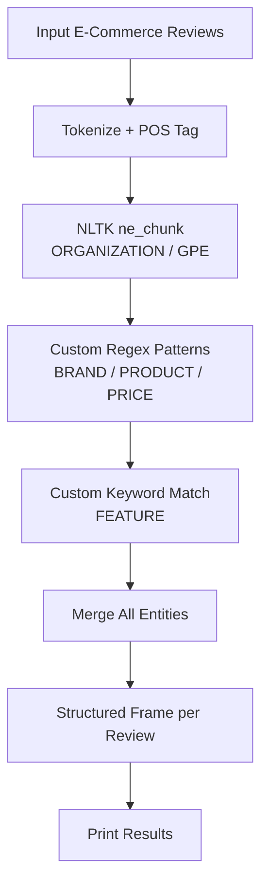

# Assignment 6: Named Entity Recognition on E-Commerce Product Reviews Using NLTK

This assignment demonstrates **Named Entity Recognition (NER)** on e-commerce product reviews using the **Natural Language Toolkit (NLTK)**. The goal is to identify and extract structured information — product names, brands, features, prices, locations, and organizations — from unstructured review text.

---

## Table of Contents

1. [Overview](#overview)
2. [How the Pipeline Works](#how-the-pipeline-works)
3. [Flowchart](#flowchart)
4. [Key Components](#key-components)
   - [Step 1: Import Libraries & Download Data](#step-1-import-libraries--download-data)
   - [Step 2: Define E-Commerce Review Samples](#step-2-define-e-commerce-review-samples)
   - [Step 3: Define Entity Extraction Rules](#step-3-define-entity-extraction-rules)
   - [Step 4: Named Entity Chunking with NLTK](#step-4-named-entity-chunking-with-nltk)
   - [Step 5: Custom Pattern Matching for E-Commerce Entities](#step-5-custom-pattern-matching-for-e-commerce-entities)
   - [Step 6: Combine Results into Structured Frame](#step-6-combine-results-into-structured-frame)
   - [Step 7: Analysis Execution](#step-7-analysis-execution)
5. [Example Output](#example-output)
6. [Frequently Asked Questions](#frequently-asked-questions)

---

## Overview

E-commerce product reviews contain rich structured information embedded in free-form text. **NER** automates the extraction of key entities that businesses can use for product analytics, sentiment tracking, inventory management, and recommendation engines.

This notebook uses a **hybrid NER approach**:

| Entity Type   | Extraction Method                        | Examples                                       |
| ------------- | ---------------------------------------- | ---------------------------------------------- |
| `ORGANIZATION`| NLTK `ne_chunk` (pre-trained classifier) | `Apple`, `Samsung`, `Amazon`                   |
| `LOCATION`    | NLTK `ne_chunk` (GPE labels)             | `New York`, `California`, `India`              |
| `BRAND`       | Custom regex + token matching            | `Apple`, `Sony`, `Dell`, `Nike`                |
| `PRODUCT`     | Custom regex + context rules             | `iPhone 15`, `Galaxy S24`, `MacBook Pro`       |
| `FEATURE`     | Custom regex + keyword dictionary        | `battery life`, `camera quality`, `display`    |
| `PRICE`       | Custom regex (currency + amount)         | `$999`, `₹45,000`, `€120.50`                   |

---

## How the Pipeline Works

1. A set of sample e-commerce product reviews is defined.
2. NLTK's `punkt` tokenizer and ` averaged_perceptron_tagger_eng` POS tagger are used for preprocessing.
3. `nltk.ne_chunk` identifies pre-trained entities: `ORGANIZATION` and `GPE` (locations).
4. Custom regex patterns and keyword lists extract: `BRAND`, `PRODUCT`, `FEATURE`, and `PRICE`.
5. Results from both sources are merged into a structured frame for each review.
6. The structured output is printed in a human-readable format.

---

## Flowchart



---

## Key Components

### Step 1: Import Libraries & Download Data

```python
import nltk
import re
```

```python
nltk.download('punkt')
nltk.download('punkt_tab')
nltk.download('averaged_perceptron_tagger_eng')
nltk.download('maxent_ne_chunker')
nltk.download('words')
```

NLTK's NER pipeline requires the Punkt tokenizer, the averaged perceptron POS tagger, the maximum entropy named entity chunker, and the English word list.

> **Note:** On newer NLTK versions (3.9+), replace `averaged_perceptron_tagger_eng` with the older package name if needed.

---

### Step 2: Define E-Commerce Review Samples

```python
reviews = [
    "I bought the iPhone 15 from Apple and the camera quality is amazing. "
    "It cost me $999 at the New York store.",

    "Samsung Galaxy S24 has excellent battery life but the display is dim. "
    "Bought it from Amazon in California for $899.",

    "My Dell XPS 15 arrived from Dell warehouse in Texas. "
    "The build quality is great and price was ₹145,000.",

    "Nike Air Max shoes have great comfort and design. "
    "Purchased from Nike outlet in Chicago for €120."
]
```

Four realistic e-commerce reviews covering different brands, products, locations, and currencies are used as test inputs.

---

### Step 3: Define Entity Extraction Rules

```python
BRANDS = [
    "apple", "samsung", "dell", "nike", "sony", "lg", "hp", "lenovo", "bose", "adidas"
]

FEATURES = [
    "battery life", "camera quality", "display", "build quality", "comfort",
    "design", "performance", "sound quality", "screen size", "storage"
]

PRICE_PATTERN = re.compile(
    r"\$[\d,]+(?:\.\d{2})?|₹[\d,]+(?:\.\d{2})?|€[\d,]+(?:\.\d{2})?"
)
```

- **BRANDS:** a known list of consumer brand names (case-insensitive).
- **FEATURES:** a keyword dictionary of common product attributes.
- **PRICE_PATTERN:** regex matching currency amounts in USD (`$`), INR (`₹`), and EUR (`€`).

---

### Step 4: Named Entity Chunking with NLTK

```python
def get_entities_ne_chunk(text):
    tokens = nltk.word_tokenize(text)
    pos_tags = nltk.pos_tag(tokens)
    chunks = nltk.ne_chunk(pos_tags)

    orgs = []
    locs = []

    for chunk in chunks:
        if hasattr(chunk, 'label'):
            entity_type = chunk.label()
            entity_text = " ".join(c[0] for c in chunk.leaves())
            if entity_type == 'ORGANIZATION':
                orgs.append(entity_text)
            elif entity_type in ['GPE', 'LOCATION', 'FACILITY']:
                locs.append(entity_text)

    return orgs, locs
```

`nltk.ne_chunk` uses a pre-trained maximum entropy classifier to identify named entities in the Penn Treebank format. The function extracts `ORGANIZATION` and geographic entities (`GPE`, `LOCATION`, `FACILITY`).

---

### Step 5: Custom Pattern Matching for E-Commerce Entities

```python
def extract_ecommerce_entities(text, orgs, locs):
    lower_text = text.lower()

    brands = list(set([
        b for b in BRANDS if re.search(rf"\b{re.escape(b)}\b", lower_text)
    ]))

    products = []
    product_patterns = [
        r"\b(?:iphone\s*\d+|galaxy\s*\w+|dell\s*xps\s*\d+|macbook\s*\w+|air\s*max)\b",
        r"\b(?:pixel\s*\d+|surface\s*\w+|thinkpad\s*\w+|galaxy\s*\w+)\b"
    ]
    for pat in product_patterns:
        matches = re.findall(pat, lower_text)
        products.extend([m.strip().title() for m in matches])

    features = [f for f in FEATURES if f.lower() in lower_text]

    prices = PRICE_PATTERN.findall(text)

    return brands, products, features, prices
```

Custom extraction handles entities that NLTK's pre-trained chunker does not specifically label:

| Entity   | Extraction Strategy                                              |
| -------- | ---------------------------------------------------------------- |
| `BRAND`  | Case-insensitive word boundary matching against a known brand list. |
| `PRODUCT`| Regex patterns for common product name conventions (e.g., `iPhone 15`, `Galaxy S24`, `Dell XPS 15`). |
| `FEATURE`| Substring matching against a keyword dictionary.                |
| `PRICE`  | Regex for currency-prefixed numeric amounts.                    |

---

### Step 6: Combine Results into Structured Frame

```python
def analyze_review(text):
    orgs, locs = get_entities_ne_chunk(text)
    brands, products, features, prices = extract_ecommerce_entities(text, orgs, locs)

    frame = {
        "ORGANIZATION": orgs or ["UNKNOWN"],
        "LOCATION": locs or ["UNKNOWN"],
        "BRAND": brands or ["UNKNOWN"],
        "PRODUCT": products or ["UNKNOWN"],
        "FEATURE": features or ["UNKNOWN"],
        "PRICE": prices or ["UNKNOWN"]
    }
    return frame
```

A unified frame merges NLTK-detected entities with custom-pattern entities. Missing categories default to `"UNKNOWN"` so the output schema remains consistent across reviews.

---

### Step 7: Analysis Execution

```python
for i, review in enumerate(reviews, 1):
    frame = analyze_review(review)
    print(f"\nReview {i}: {review.strip()}")
    print("-" * 60)
    for key, values in frame.items():
        print(f"{key:<15}: {', '.join(values)}")
```

Each review is processed through the full pipeline, and the resulting frame is printed in a tabular key-value format.

---

## Example Output

```
Review 1: I bought the iPhone 15 from Apple and the camera quality is amazing. It cost me $999 at the New York store.
------------------------------------------------------------
ORGANIZATION   : Apple
LOCATION       : New York
BRAND          : Apple
PRODUCT        : Iphone 15
FEATURE        : camera quality
PRICE          : $999

Review 2: Samsung Galaxy S24 has excellent battery life but the display is dim. Bought it from Amazon in California for $899.
------------------------------------------------------------
ORGANIZATION   : Amazon
LOCATION       : California
BRAND          : Samsung
PRODUCT        : Galaxy S24
FEATURE        : battery life, display
PRICE          : $899
```

> **Note:** NLTK's `ne_chunk` may not recognize every brand or location depending on its training data. The custom patterns fill those gaps for known e-commerce entities.

---

## Frequently Asked Questions

### 1. Why use a hybrid approach instead of only `ne_chunk`?

NLTK's pre-trained `ne_chunk` is trained on general newswire text (OntoNotes) and primarily identifies `PERSON`, `ORGANIZATION`, and `GPE` (locations). It does **not** recognize domain-specific entities like brands (`Apple` as a tech brand), products (`iPhone 15`), features (`camera quality`), or prices. Custom rules are required for these e-commerce categories.

### 2. What is the difference between GPE, LOCATION, and FACILITY?

- **GPE (Geo-Political Entity):** countries, states, cities (e.g., `New York`, `California`).
- **LOCATION:** non-GPE locations like `Midwest`, `the West Coast`.
- **FACILITY:** buildings, airports, highways (e.g., `store`, `warehouse`).

`ne_chunk` labels all three as separate categories. The code normalizes them under `LOCATION`.

### 3. How accurate is the brand detection?

The brand list is hard-coded. It detects only the brands explicitly listed in the `BRANDS` list and requires exact word-boundary matches. It will miss brands not in the list (e.g., `OnePlus`, `Xiaomi`). A production system would use a larger brand database or a fine-tuned NER model.

### 4. Why does the notebook use `ne_chunk` instead of `nltk.parse` or other libraries?

`ne_chunk` is NLTK's standard, pre-trained NER module. It requires no model training or external APIs. For domain-specific NER (e-commerce), it serves as a baseline for generic entities, while custom rules handle domain-specific categories.

### 5. What happens if an entity appears in both NLTK and custom patterns?

Both results are collected and presented together. For example, `Apple` may appear as an `ORGANIZATION` from `ne_chunk` and also as a `BRAND` from the custom list. The frame preserves both entries so the downstream consumer can decide which to use.

### 6. How do I run the code?

The code is provided as a Jupyter notebook (`code.ipynb`). Open it in Jupyter Notebook/Lab and execute the cells in order. Alternatively, extract the code into a `.py` file and run it with Python 3 after installing NLTK:

```bash
pip install nltk
python code.py
```

### 7. What NLTK data packages are required?

The notebook requires the following NLTK data: `punkt` (or `punkt_tab`), `averaged_perceptron_tagger_eng` (or `averaged_perceptron_tagger`), `maxent_ne_chunker`, and `words`. Download them with:

```python
import nltk
nltk.download('punkt_tab')
nltk.download('averaged_perceptron_tagger_eng')
nltk.download('maxent_ne_chunker')
nltk.download('words')
```
