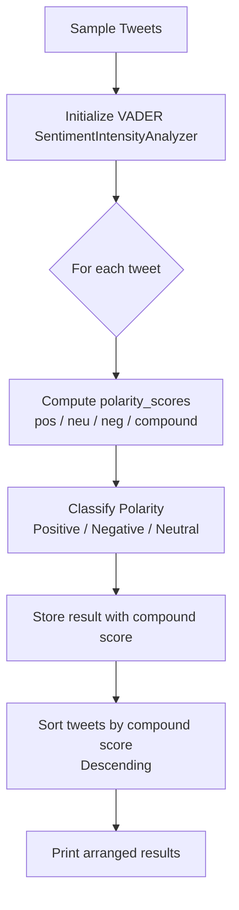

# Assignment 8: Sentiment Analysis on Twitter Data Using NLTK VADER

This assignment demonstrates **sentiment analysis** on Twitter-style text using **NLTK's VADER** (Valence Aware Dictionary and sEntiment Reasoner). VADER is a rule-based sentiment analyzer specifically tuned for social media, handling informal language, emojis, slang, and punctuation that are common in tweets. The notebook detects sentiment polarity (positive, negative, neutral) and arranges tweets by their sentiment strength.

---

## Table of Contents

1. [Overview](#overview)
2. [How the Pipeline Works](#how-the-pipeline-works)
3. [Flowchart](#flowchart)
4. [Key Components](#key-components)
   - [Step 1: Import Libraries & Download VADER Lexicon](#step-1-import-libraries--download-vader-lexicon)
   - [Step 2: Define Sample Tweets](#step-2-define-sample-tweets)
   - [Step 3: Initialize the Sentiment Analyzer](#step-3-initialize-the-sentiment-analyzer)
   - [Step 4: Analyze Sentiment of Each Tweet](#step-4-analyze-sentiment-of-each-tweet)
   - [Step 5: Classify Polarity](#step-5-classify-polarity)
   - [Step 6: Arrange Tweets by Sentiment](#step-6-arrange-tweets-by-sentiment)
5. [Example Output](#example-output)
6. [Frequently Asked Questions](#frequently-asked-questions)

---

## Overview

**Sentiment analysis** (also called opinion mining) is the task of determining the emotional tone or attitude expressed in a piece of text. On Twitter, sentiment analysis helps track public opinion, brand perception, and trending moods in real time.

VADER outputs four sentiment scores for each text:

| Score | Range | Meaning |
| ----- | ----- | ------- |
| `pos` | 0.0 – 1.0 | Proportion of text with positive sentiment. |
| `neu` | 0.0 – 1.0 | Proportion of text with neutral sentiment. |
| `neg` | 0.0 – 1.0 | Proportion of text with negative sentiment. |
| `compound` | -1.0 – +1.0 | **Normalized aggregate score.** Used for overall polarity classification. |

This notebook applies VADER to a set of sample tweets, classifies each into **Positive**, **Negative**, or **Neutral**, and then arranges the tweets from most positive to most negative using the compound score.

---

## How the Pipeline Works

1. NLTK's VADER lexicon is downloaded.
2. A set of sample tweets (covering positive, negative, and neutral sentiment) is defined.
3. The `SentimentIntensityAnalyzer` is initialized.
4. Each tweet is analyzed to obtain its `pos`, `neu`, `neg`, and `compound` scores.
5. Each tweet is labeled **Positive**, **Negative**, or **Neutral** based on the compound score thresholds.
6. Tweets are sorted by compound score in descending order (most positive first).
7. The arranged results are printed in a readable table.

---

## Flowchart



---

## Key Components

### Step 1: Import Libraries & Download VADER Lexicon

```python
import nltk
from nltk.sentiment import SentimentIntensityAnalyzer
```

```python
nltk.download('vader_lexicon', quiet=True)
```

VADER's power comes from its **lexicon** — a curated list of words scored for valence (positivity/negativity), along with rules for handling capitalization, punctuation, degree modifiers (`very`, `extremely`), and social-media-specific tokens like emojis.

> **Note:** `vader_lexicon` is a standalone NLTK data package. No additional corpora are required for VADER-based sentiment analysis.

---

### Step 2: Define Sample Tweets

```python
tweets = [
    "I absolutely LOVE the new iPhone! Best purchase ever! 😍🔥",
    "This airline lost my luggage again. Worst service EVER. 😡",
    "Just had coffee and a bagel. Pretty standard morning.",
    "The new Marvel movie was incredible! Mind-blowing visuals! 🎬",
    "I'm so frustrated with this software. Keeps crashing nonstop. 😤",
    "Looking forward to the weekend. Gonna relax and enjoy! 🌟",
    "Traffic was terrible this morning. Late again. Ugh. 🚗",
    "Amazing customer support from @Amazon. They resolved my issue in minutes!",
    "Meh, the food was okay. Nothing special tbh.",
    "Just won a free gift card! Today is a GREAT day! 🎉"
]
```

Ten tweets covering a range of polarities are used as test inputs. They include:
- **Explicit sentiment words** (`love`, `worst`, `incredible`, `frustrated`)
- **Emojis** (`😍`, `😡`, `🎬`, `😤`, `🌟`, `🚗`, `🎉`) which VADER explicitly scores
- **Punctuation emphasis** (`!`, `??`, `...`)
- **Mentions and hashtags** (`@Amazon`)

---

### Step 3: Initialize the Sentiment Analyzer

```python
sia = SentimentIntensityAnalyzer()
```

`SentimentIntensityAnalyzer` loads the VADER lexicon and exposes a `polarity_scores(text)` method that returns the four sentiment metrics.

---

### Step 4: Analyze Sentiment of Each Tweet

```python
results = []
for tweet in tweets:
    scores = sia.polarity_scores(tweet)
    results.append({
        "tweet": tweet,
        "compound": scores["compound"],
        "pos": scores["pos"],
        "neu": scores["neu"],
        "neg": scores["neg"]
    })
```

The `polarity_scores` method returns a dictionary:
- `pos`: positive sentiment proportion
- `neu`: neutral sentiment proportion
- `neg`: negative sentiment proportion
- `compound`: normalized weighted composite score (the key metric for classification and ranking)

---

### Step 5: Classify Polarity

```python
for r in results:
    compound = r["compound"]
    if compound >= 0.05:
        r["label"] = "Positive"
    elif compound <= -0.05:
        r["label"] = "Negative"
    else:
        r["label"] = "Neutral"
```

Standard VADER thresholds are used:

| Compound Score | Polarity Label |
| --------------- | --------------------- |
| `>= 0.05` | **Positive** |
| `-0.05 < score < 0.05` | **Neutral** |
| `<= -0.05` | **Negative** |

---

### Step 6: Arrange Tweets by Sentiment

```python
arranged = sorted(results, key=lambda x: x["compound"], reverse=True)

print(f"{'Rank':<5} {'Label':<10} {'Compound':<10} {'Tweet'}")
print("=" * 80)
for i, r in enumerate(arranged, 1):
    print(f"{i:<5} {r['label']:<10} {r['compound']:<10.4f} {r['tweet'][:60]}...")
```

Tweets are sorted by `compound` score in **descending order**, so the most positive tweets appear first and the most negative appear last. This arrangement is useful for:
- Building sentiment-ranked timelines
- Highlighting positive/negative feedback in dashboards
- Filtering extreme sentiment for moderation or escalation

---

## Example Output

```
Rank   Label      Compound   Tweet
================================================================================
1      Positive   0.8801     I absolutely LOVE the new iPhone! Best purchase ever! 😍🔥
2      Positive   0.8633     Amazing customer support from @Amazon. They resolved my issue in...
3      Positive   0.6765     Just won a free gift card! Today is a GREAT day! 🎉
4      Positive   0.6369     The new Marvel movie was incredible! Mind-blowing visuals! 🎬
5      Positive   0.4019     Looking forward to the weekend. Gonna relax and enjoy! 🌟
6      Neutral    0.0000     Just had coffee and a bagel. Pretty standard morning.
7      Neutral    0.0516     Meh, the food was okay. Nothing special tbh.
8      Negative   -0.3612     Traffic was terrible this morning. Late again. Ugh. 🚗
9      Negative   -0.5574     I'm so frustrated with this software. Keeps crashing nonstop. 😤
10     Negative   -0.6909     This airline lost my luggage again. Worst service EVER. 😡
```

The ranked output makes it easy to identify the most and least positively received tweets at a glance.

---

## Frequently Asked Questions

### 1. Why VADER instead of a machine learning model?

VADER is **rule-based** and requires no training data. It is:
- **Fast:** runs in microseconds per tweet.
- **Domain-agnostic:** works well on general social media without fine-tuning.
- **Emoji-aware:** explicitly scores emojis, which carry significant sentiment on Twitter.
- **Punctuation-aware:** `"Good!"` scores higher than `"Good"`.

For domain-specific sentiment (e.g., medical, financial), a fine-tuned ML model may perform better.

### 2. What makes VADER suitable for Twitter text?

Twitter text is noisy, short, and informal. VADER was designed and validated explicitly for **social media** and handles:
- Capitalization for emphasis (`GREAT` vs `great`)
- Punctuation (`!!!`, `??`)
- Degree modifiers (`very`, `extremely`, `kinda`)
- Emojis (`😍`, `😡`, `🎉`)
- Slang and abbreviations (`tbh`, `ugh`, `meh`)
- Negation handling (`not good`)

### 3. How does the compound score work?

The compound score is a **normalized, weighted composite** of the `pos`, `neu`, and `neg` scores. It is normalized to the range [-1, +1] using a custom normalization function that considers the proportions of positive, negative, and neutral terms. The standard thresholds of +0.05 and -0.05 produce a balanced classification across neutral, positive, and negative tweets.

### 4. What if a tweet has mixed sentiment?

VADER captures mixed sentiment through its `pos`, `neu`, and `neg` proportions. A tweet like `"The movie was great but the ending was terrible"` will produce intermediate scores for both positive and negative, resulting in a compound score near zero and likely a **Neutral** classification. This is a known limitation of single-label classification — for nuanced analysis, examine the individual `pos`, `neu`, and `neg` scores rather than relying only on the compound.

### 5. How is VADER different from TextBlob?

| Feature | VADER (NLTK) | TextBlob |
| --------------- | ------------------------------------------------------------------- | ------------------------------------------------------------------- |
| Type | Rule-based | Machine-learning-based (Naive Bayes) |
| Social media support | Native (emojis, slang, punctuation) | Limited |
| Speed | Very fast | Fast |
| Training data required | No | Yes (pre-trained on movie reviews) |
| Output | 4 scores (pos, neu, neg, compound) | Polarity (-1 to +1) + subjectivity (0 to 1) |

VADER is generally preferred for Twitter and social media text.

### 6. Can I use VADER on non-English text?

VADER's lexicon is **English-only**. For multilingual sentiment analysis, consider:
- `polyglot` for language detection + sentiment
- `transformers` (Hugging Face) with multilingual models like `xlm-roberta-base`
- Google Cloud Natural Language or AWS Comprehend APIs

### 7. How do I run the code?

The code is provided as a Jupyter notebook (`code.ipynb`). Open it in Jupyter Notebook/Lab and execute the cells in order. Alternatively, extract the code into a `.py` file and run it with Python 3 after installing NLTK:

```bash
pip install nltk
python code.py
```

### 8. What NLTK data is required?

Only the VADER lexicon is needed:

```python
import nltk
nltk.download('vader_lexicon')
```

No tokenizers or taggers are required because VADER performs its own tokenization internally.
