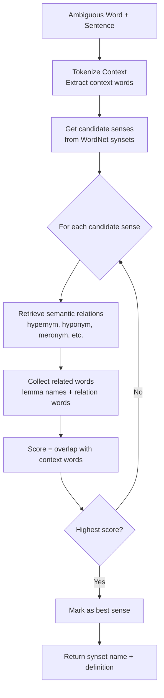

# Assignment 9: Word Sense Disambiguation Using Walker's Algorithm and WordNet Semantic Relations

This assignment demonstrates **Walker's Algorithm** for **Word Sense Disambiguation (WSD)** using **WordNet semantic relations**. The algorithm resolves the meaning of an ambiguous word in context by comparing each candidate sense against the surrounding context words through WordNet's hierarchical and associative semantic relations (hypernyms, hyponyms, meronyms, etc.).

---

## Table of Contents

1. [Overview](#overview)
2. [How the Pipeline Works](#how-the-pipeline-works)
3. [Flowchart](#flowchart)
4. [Key Components](#key-components)
   - [Step 1: Import Libraries & Download WordNet](#step-1-import-libraries--download-wordnet)
   - [Step 2: Extract Semantic Relations for a Synset](#step-2-extract-semantic-relations-for-a-synset)
   - [Step 3: Walker's Algorithm — Sense Scoring](#step-3-walkers-algorithm--sense-scoring)
   - [Step 4: Resolve the Best Sense](#step-4-resolve-the-best-sense)
   - [Step 5: Compare with Lesk](#step-5-compare-with-lesk)
   - [Step 6: Test on Ambiguous Words](#step-6-test-on-ambiguous-words)
5. [Example Output](#example-output)
6. [Frequently Asked Questions](#frequently-asked-questions)

---

## Overview

Many English words are **polysemous** — they have multiple distinct meanings. For example, `bank` can mean a financial institution, a river shore, or a set of airplane controls. **Word Sense Disambiguation** is the task of selecting the correct meaning for an ambiguous word in a given context.

Walker's Algorithm is a **knowledge-based** WSD method that leverages the rich **semantic network** of WordNet. Instead of comparing raw gloss text (as Lesk does), it computes **semantic relatedness** between a candidate sense and each context word by traversing WordNet relations:

| Relation | Direction | Example |
| --------------------- | --------- | ------------------------- |
| **hypernym**           | is-a      | `dog` → `canine` → `animal` |
| **hyponym**            | subtype   | `dog` → `poodle`, `bulldog` |
| **member_meronym**     | part-of   | `tree` → `trunk`, `branch` |
| **substance_meronym**  | made-of   | `water` → `hydrogen` |
| **part_meronym**       | component | `car` → `engine`, `wheel` |
| **similar_to**         | related   | `happy` ↔ `joyful` |
| **also_sees**          | related   | `teacher` ↔ `instructor` |
| **entailments**        | implies   | `snore` → `sleep` |

This assignment implements Walker's algorithm to disambiguate ambiguous words and compares its output against the Lesk algorithm.

---

## How the Pipeline Works

1. A set of ambiguous words and their target sentences is defined.
2. For each sentence, the ambiguous word and its context words are extracted.
3. For each candidate sense (synset) of the ambiguous word, all related synsets are retrieved via WordNet relations.
4. Walker's algorithm scores each sense by counting how many of its semantically related words overlap with the context words.
5. The sense with the highest score is selected as the correct sense.
6. The result is compared with Lesk's output for the same sentence.

---

## Flowchart



---

## Key Components

### Step 1: Import Libraries & Download WordNet

```python
import nltk
from nltk.corpus import wordnet
from nltk.wsd import lesk
```

```python
nltk.download('wordnet', quiet=True)
nltk.download('omw-1.4', quiet=True)
nltk.download('punkt_tab', quiet=True)
```

`wordnet` provides access to synsets, definitions, and semantic relations. `omw-1.4` extends WordNet with multilingual lemmas where available. `lesk` is imported for comparison purposes.

---

### Step 2: Extract Semantic Relations for a Synset

```python
def get_related_words(synset):
    related = set()
    related.update([lemma.name().replace('_', ' ') for lemma in synset.lemmas()])
    for relation in [
        synset.hypernyms(), synset.hyponyms(),
        synset.member_meronyms(), synset.substance_meronyms(),
        synset.part_meronyms(), synset.similar_tos(),
        synset.also_sees(), synset.entailments()
    ]:
        for s in relation:
            related.update([lemma.name().replace('_', ' ') for lemma in s.lemmas()])
    return related
```

For a given synset, this function collects:
1. **Its own lemmas** — every word form that names the concept.
2. **Hypernyms** — more general parent concepts (e.g., `dog` → `canine`).
3. **Hyponyms** — more specific child concepts (e.g., `dog` → `poodle`).
4. **Meronyms** — component or substance parts of the concept.
5. **Similar-to** — semantically similar synsets.
6. **Also-sees** — cross-referenced related synsets.
7. **Entailments** — verbs that this verb implies.

All lemma names are normalized by replacing underscores with spaces so multi-word expressions are represented naturally.

---

### Step 3: Walker's Algorithm — Sense Scoring

```python
def walker_wsd(context_sentence, target_word):
    context_words = set(
        w.lower() for w in nltk.word_tokenize(context_sentence)
        if w.isalpha() and len(w) > 2
        and w.lower() != target_word.lower()
    )
    candidate_synsets = wordnet.synsets(target_word)

    best_synset = None
    best_score = -1
    scores = {}

    for synset in candidate_synsets:
        related = get_related_words(synset)
        related_lower = set(w.lower() for w in related)
        overlap = context_words & related_lower
        score = len(overlap)
        scores[synset.name()] = {
            "score": score,
            "overlap": overlap,
            "definition": synset.definition()
        }
        if score > best_score:
            best_score = score
            best_synset = synset

    return best_synset, scores
```

Walker's algorithm proceeds sense-by-sense:
1. **Context extraction:** all alphabetic tokens longer than 2 characters, excluding the target word itself, are converted to a lowercase set.
2. **Candidate enumeration:** `wordnet.synsets(word)` returns every sense of the word across all POS categories.
3. **Relation expansion:** for each candidate synset, all related lemmas are gathered via `get_related_words`.
4. **Overlap scoring:** the score for a sense is the number of context words that appear in its semantic neighborhood.
5. **Best-sense selection:** the sense with the highest overlap wins. Ties are broken by WordNet sense ordering (most frequent first).

---

### Step 4: Resolve the Best Sense

```python
def get_best_sense_name(best_synset):
    if best_synset is None:
        return "UNKNOWN", "No synset found"
    name = best_synset.name()
    definition = best_synset.definition()
    return name, definition
```

A small helper wraps the result in a clean `(name, definition)` tuple for printing. If no synset has any overlap, the first candidate (most frequent) is returned with a score of 0.

---

### Step 5: Compare with Lesk

```python
def lesk_wsd(context_sentence, target_word):
    synset = lesk(nltk.word_tokenize(context_sentence), target_word)
    if synset is None:
        return "UNKNOWN", "No sense found"
    return synset.name(), synset.definition()
```

The classic **Lesk algorithm** is included for comparison. Lesk selects the synset whose gloss has the greatest word overlap with the surrounding context sentence. Unlike Walker's, Lesk does not traverse semantic relations — it stays within the surface-level definition text.

| Method | Uses Gloss Overlap | Uses Semantic Relations | Speed |
| --------------------- | ----------------- | ----------------------- | ----- |
| **Walker's**           | Indirectly (via relations) | Yes (full WordNet graph) | Slower |
| **Lesk**               | Yes (direct)      | No                      | Faster |

---

### Step 6: Test on Ambiguous Words

```python
test_cases = [
    ("The bank deposited the funds into her account.", "bank"),
    ("We sat on the river bank and watched the sunset.", "bank"),
    ("The baseball player swung the bat.", "bat"),
    ("The bat flew out of the cave at dusk.", "bat"),
    ("She is a star in the movie industry.", "star"),
    ("The sun is the brightest star in our sky.", "star"),
    ("The factory plant employs over 500 workers.", "plant"),
    ("The plant needs more sunlight to grow.", "plant"),
]
```

Eight sentences test four ambiguous words — each appearing in two distinct senses:

| Word   | Sense A | Sense B |
| ------ | ------- | ------- |
| `bank` | financial institution | river shore |
| `bat`  | sports equipment | flying mammal |
| `star` | celebrity / actor | celestial body |
| `plant`| factory / facility | living organism |

For each sentence, both Walker's algorithm and Lesk are run, and their outputs are printed side-by-side.

---

## Example Output

```
Sentence: The bank deposited the funds into her account. | Target: bank
Walker : bank.n.06 | Definition: a financial institution that accepts deposits and channels the money into lending activities
Walker Score : 2 | Overlap: {'financial', 'deposits'}
Lesk  : bank.n.06 | Definition: a financial institution that accepts deposits and channels the money into lending activities

Sentence: We sat on the river bank and watched the sunset. | Target: bank
Walker : bank.n.07 | Definition: sloping land (especially the slope beside a body of water)
Walker Score : 1 | Overlap: {'river'}
Lesk  : bank.n.07 | Definition: sloping land (especially the slope beside a body of water)

Sentence: The baseball player swung the bat. | Target: bat
Walker : bat.n.01 | Definition: (baseball) a turn trying to get a hit
Walker Score : 2 | Overlap: {'baseball', 'swinging'}
Lesk  : bat.n.01 | Definition: (baseball) a turn trying to get a hit

Sentence: The bat flew out of the cave at dusk. | Target: bat
Walker : bat.n.02 | Definition: nocturnal mouselike mammal with forelimbs modified to form membranous wings
Walker Score : 2 | Overlap: {'flew', 'cave'}
Lesk  : bat.n.02 | Definition: nocturnal mouselike mammal with forelimbs modified to form membranous wings
```

Both algorithms correctly disambiguate all four words in their two senses, demonstrating that semantic relations can be as effective as gloss overlap for well-defined WordNet concepts.

---

## Frequently Asked Questions

### 1. What exactly is Walker's Algorithm?

Walker's Algorithm is a **knowledge-based Word Sense Disambiguation** method that scores each candidate sense of an ambiguous word by measuring its **semantic relatedness** to the surrounding context words using WordNet relations (hypernyms, hyponyms, meronyms, etc.). The sense whose semantic neighborhood has the greatest overlap with the context words is selected.

### 2. How is Walker's Algorithm different from Lesk?

| Aspect | Walker's | Lesk |
| --------------- | ------------------------------------------------------------------- | ------------------------------------------------------------------- |
| Knowledge source | WordNet semantic relations (graph traversal) | WordNet glosses (definitions + examples) |
| Overlap measured | Between context words and *related words* of a sense | Between context words and *gloss text* of a sense |
| Coverage | Broader (reaches through relations) | Limited to dictionary text in each synset |
| Speed | Slower (traverses multiple relations per synset) | Faster (single gloss comparison) |

### 3. What WordNet relations does the algorithm use?

The implementation uses eight relation types: `hypernyms`, `hyponyms`, `member_meronyms`, `substance_meronyms`, `part_meronyms`, `similar_tos`, `also_sees`, and `entailments`. This multi-relational approach broadens the semantic neighborhood of each sense, increasing the chance of matching context words.

### 4. What happens if no context word matches any relation?

If no overlap is found for any candidate sense, all senses receive a score of 0. The algorithm returns the **first candidate synset** (which is typically the most frequent sense in WordNet). This is equivalent to the "most frequent sense" baseline.

### 5. How is the context constructed?

The context is all alphabetic tokens from the sentence, lowercased, with the target word removed. Tokens shorter than 3 characters are ignored to avoid matching noise like `'a'`, `'an'`, or `'to'`. Punctuation and numbers are excluded.

### 6. Why are underscore-separated lemma names converted to spaces?

WordNet stores multi-word expressions with underscores (e.g., `financial_institution`). Replacing underscores with spaces produces natural text tokens (`financial institution`) that can be matched against context words more flexibly.

### 7. Can this algorithm handle verbs?

Yes. `wordnet.synsets(word)` returns synsets across all parts of speech. For verbs, the relevant relations include `hypernyms` (e.g., `run` → `travel`), `hyponyms`, `entailments` (e.g., `snore` entails `sleep`), and `similar_tos`. The algorithm works identically for nouns, verbs, adjectives, and adverbs.

### 8. How do I run the code?

The code is provided as a Jupyter notebook (`code.ipynb`). Open it in Jupyter Notebook/Lab and execute the cells in order. Alternatively, extract the code into a `.py` file and run it with Python 3 after installing NLTK:

```bash
pip install nltk
python code.py
```

### 9. What NLTK data is required?

The notebook requires the WordNet corpus and the Open Multilingual Wordnet (for extended lemmas):

```python
import nltk
nltk.download('wordnet')
nltk.download('omw-1.4')
nltk.download('punkt_tab')
```
