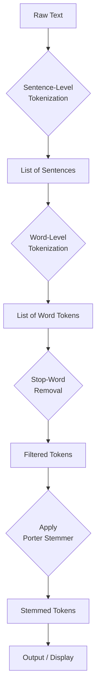
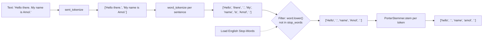

# Day 0: Introduction to NLP — Text Preprocessing with NLTK

## Assignment: ass1.ipynb

This assignment introduces fundamental Natural Language Processing (NLP) preprocessing techniques using the NLTK library. The notebook (`ass1.ipynb`) demonstrates tokenization, stop-word removal, and stemming on sample text.

---

## 1. Theory

### What is NLP Preprocessing?

Natural Language Processing (NLP) preprocessing is the initial step in any NLP pipeline where raw text is cleaned and transformed into a structured format that machines can understand and process. Human language is messy — it contains punctuation, irrelevant words, variations in spelling, and different grammatical forms. Preprocessing normalizes this text.

### Tokenization

Tokenization is the process of splitting text into smaller units called **tokens**. There are two levels:

- **Sentence-level tokenization**: Splits a paragraph or document into individual sentences. Uses punctuation and capitalization cues.
- **Word-level tokenization**: Splits a sentence into individual words (or punctuation marks as separate tokens).

### Stop-Words

Stop-words are common words (e.g., "the", "is", "at", "which", "and") that appear frequently in a language but carry little semantic meaning. Removing them reduces noise and dimensionality in text data, improving the efficiency of downstream NLP tasks like classification, search, and clustering.

### Stemming

Stemming reduces words to their root or base form using heuristic, rule-based algorithms. The **Porter Stemmer** is the most widely used stemmer. It applies a series of morphological rules to strip suffixes:

| Original Word | Stemmed Form |
| ------------- | ------------ |
| running       | run          |
| flies         | fli          |
| organization  | organ        |
| reading       | read         |
| better        | better       |

Stemming is fast but not always linguistically accurate — it produces truncated roots rather than real dictionary words.

---

## 2. Code Explanation

### Imports and Setup

```python
import nltk
from nltk.tokenize import word_tokenize, sent_tokenize
from nltk.corpus import stopwords
from nltk.stem import PorterStemmer

nltk.download('punkt')
nltk.download('punkt_tab')
nltk.download('stopwords')
nltk.download('wordnet')
```

All required NLTK modules are imported: `sent_tokenize` and `word_tokenize` for tokenization, `stopwords` for stop-word removal, and `PorterStemmer` for stemming. The `nltk.download()` calls ensure necessary corpora are available.

---

### Cell 1 — Sentence-Level Tokenization

```python
text = "Hello there. My name is Amol. I am learning Natural Language Processing."
sentences = nltk.sent_tokenize(text)
```

`nltk.sent_tokenize()` uses the Punkt tokenizer model to split the text at sentence boundaries (periods, question marks, exclamations). The result is a list of sentence strings.

---

### Cell 2 — Word-Level Tokenization

```python
words = nltk.word_tokenize(text)
```

`nltk.word_tokenize()` splits each sentence into individual tokens — words and punctuation marks are treated as separate tokens. It applies the Punkt word tokenizer internally.

---

### Cell 3 — Stop-Word Removal

```python
stop_words = set(stopwords.words('english'))
filtered_words = [word for word in words if word.lower() not in stop_words]
```

The English stop-word list from NLTK is loaded as a `set` for O(1) lookup. A list comprehension filters out any token whose lowercase form exists in the stop-word set. Punctuation tokens (e.g., `.`) are retained since they are not in the stop-word list — they would be handled separately if needed (see `punctuation.py`).

---

### Cell 4 — Stemming

```python
stemmer = PorterStemmer()
sample_tokens = ['running', 'flies', 'organization', 'reading', 'better', 'connection', 'computing']
stemmed = [stemmer.stem(word) for word in sample_tokens]
```

An instance of `PorterStemmer` is created. The `.stem()` method is applied to each token using a list comprehension. The stemmer strips common suffixes to produce root forms. The same stemmer is also applied to the filtered tokens to show the full pipeline.

---

## 3. Program Flowchart



### Detailed Tokenization + Stop-Word Removal Flow



---

## 4. Frequently Asked Questions (FAQ)

### Q1: What is the difference between sentence-level and word-level tokenization?

**A:** Sentence-level tokenization (`nltk.sent_tokenize`) splits text into sentences based on punctuation boundaries. Word-level tokenization (`nltk.word_tokenize`) splits text into individual words and punctuation tokens. Sentence tokenization is the first step; word tokenization is applied to each sentence.

### Q2: Why do we convert words to lowercase before checking stop-words?

**A:** The NLTK stop-word list contains only lowercase entries (e.g., `"my"`, not `"My"`). Converting tokens to lowercase before comparison ensures case-insensitive matching so that capitalized stop-words like `"My"` or `"I"` are correctly identified and removed.

### Q3: What is the Porter Stemmer algorithm?

**A:** The Porter Stemmer, developed by Martin Porter in 1980, is a rule-based algorithm that strips common morphological suffixes from English words in a series of five phases. Each phase applies a set of rewriting rules to progressively reduce word endings to a common stem.

### Q4: What is the difference between stemming and lemmatization?

**A:** Stemming uses heuristic rules to chop off suffixes, often producing non-dictionary words (e.g., "organization" → "organ"). Lemmatization uses vocabulary and morphological analysis to return the dictionary form (lemma), producing valid words (e.g., "better" → "good" with lemmatization, but "better" → "better" with stemming).

### Q5: Why are punctuation marks kept after tokenization but not removed during stop-word filtering?

**A:** Punctuation tokens (e.g., `.`, `,`, `?`) are not words and are not present in the stop-word list. They need to be explicitly removed separately using `string.punctuation` or a custom filter, as done in `punctuation.py`.

### Q6: What happens if NLTK data (punkt, stopwords) is not downloaded?

**A:** NLTK will raise a `LookupError` when trying to tokenize or access stop-words without the required data packages. The `nltk.download()` calls in the notebook ensure all necessary corpora and models are available before execution.

### Q7: Why do we use a `set` for stop-words instead of a `list`?

**A:** Checking membership (`in`) in a `set` has O(1) average time complexity, whereas checking membership in a `list` has O(n). Since the English stop-word list contains over 150 words and is called for every token, using a `set` significantly improves performance.

### Q8: What are some common limitations of stemming?

**A:** Stemming can over-stem (e.g., "universe" and "university" both become "univers") or under-stem (e.g., "data" and "datum" are not reduced to a common root). It also produces non-words like "fli" (from "flies") and does not consider context or part of speech.

### Q9: How can we remove punctuation along with stop-words in a single step?

**A:** You can chain the filtering conditions: `[word for word in tokens if word.lower() not in stop_words and word not in string.punctuation]`. This removes both stop-words and punctuation tokens in one pass, as demonstrated in `punctuation.py`.

### Q10: Can NLTK tokenizers handle other languages besides English?

**A:** Yes. `nltk.sent_tokenize(text, language='french')` and similar language-specific options are available for sentence tokenization. Stop-word lists are available for multiple languages via `stopwords.words('french')`, `stopwords.words('german')`, etc. However, word tokenization language support depends on the punkt tokenizer models for that language.
