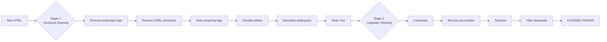

# HTML Text Cleaning Pipeline: Regex + NLTK

This document explains a **two-stage text cleaning pipeline** for processing raw HTML content into clean, tokenized text suitable for Natural Language Processing (NLP) tasks.

## Architecture

```
Raw HTML → Stage 1: Structural Cleaning → Stage 2: Linguistic Cleaning → Clean Tokens
```

The pipeline separates concerns into distinct phases for maintainability and clarity.

---

## Stage 1: Structural Cleaning (`extract_text_with_regex`)

Removes HTML structure and extracts plain text using regular expressions.

```python
def extract_text_with_regex(raw_html):
    """Stage 1: Structural cleaning using regex."""
    
    # 1. Remove <script> and <style> blocks entirely, including their contents
    text = re.sub(r'(?is)<(script|style).*?>.*?</\1>', '', raw_html)
    
    # 2. Remove HTML comments
    text = re.sub(r'(?s)<!--.*?-->', '', text)
    
    # 3. Replace all remaining HTML tags with a space
    text = re.sub(r'<[^>]+>', ' ', text)
    
    # 4. Decode HTML entities
    text = html.unescape(text)
    
    # 5. Normalize whitespace
    text = re.sub(r'\s+', ' ', text).strip()
    
    return text
```

### Step-by-Step Breakdown

| Step | Regex Pattern | Explanation |
|------|---------------|-------------|
| 1 | `(?is)<(script\|style).*?>.*?</\1>` | `(?i)` case-insensitive, `(?s)` dot matches newlines, `\1` backreference to tag name |
| 2 | `(?s)<!--.*?-->` | `(?s)` enables multiline matching, `.*?` non-greedy match |
| 3 | `<[^>]+>` | Matches any HTML tag, replaced with space to prevent word merging |
| 4 | `html.unescape()` | Decodes entities: `&amp;` → `&`, `&nbsp;` → space, `&copy;` → © |
| 5 | `\s+` | Collapses multiple whitespace into single space |

---

## Stage 2: Linguistic Cleaning (`process_nlp_tokens`)

Prepares extracted text for NLP analysis by normalizing and filtering tokens.

```python
def process_nlp_tokens(clean_text):
    """Stage 2: Linguistic cleaning using NLTK and Regex."""
    
    # 1. Lowercase for uniformity
    text = clean_text.lower()
    
    # 2. Strip punctuation
    text = re.sub(r'[^\w\s]', '', text)
    
    # 3. Tokenize into individual words
    tokens = word_tokenize(text)
    
    # 4. Remove stopwords
    stop_words = set(stopwords.words('english'))
    filtered_tokens = [word for word in tokens if word not in stop_words]
    
    return filtered_tokens
```

### Step-by-Step Breakdown

| Step | Operation | Purpose |
|------|-----------|---------|
| 1 | `.lower()` | Ensures case uniformity (e.g., "The" and "the" become identical) |
| 2 | `[^\w\s]` | Removes punctuation while preserving alphanumeric and whitespace |
| 3 | `word_tokenize()` | NLTK's tokenizer splits text into linguistic tokens |
| 4 | Stopword filtering | Removes common words with little semantic value |

---

## NLTK Setup

```python
import nltk
nltk.download('punkt')      # Tokenizer models
nltk.download('stopwords')  # Stopword corpus
```

These downloads are required once per machine to fetch NLTK's pre-trained data.

---

## Expected Input/Output

### Input
Raw HTML containing:
- CSS styles in `<style>` tags
- JavaScript in `<script>` tags
- Navigation elements
- Article content with headings
- HTML entities (`&amp;`, `&nbsp;`, `&copy;`)
- Tables and structured data

### Output

**Stage 1 - Cleaned Text:**
```
"nlp data cleaning home about contact natural language processing artificial intelligence interactions computers human language scraping text web messy html entities like lt gt need decoding extra spaces must collapsed prevent tokenization errors key tasks nlp tokenization word sentence part-of-speech pos tagging named entity recognition ner model performance metrics transformer bert accuracy f1-score rnn lstm 2026 nlp data corp rights reserved tracking pixel image img src tracker gif alt tracker"
```

**Stage 2 - NLP Tokens:**
```python
['nlp', 'data', 'cleaning', 'natural', 'language', 'processing', 'artificial', 'intelligence', 'interactions', 'computers', 'human', 'language', 'scraping', 'text', 'web', 'messy', 'html', 'entities', 'like', 'lt', 'gt', 'need', 'decoding', 'extra', 'spaces', 'must', 'collapsed', 'prevent', 'tokenization', 'errors', ...]
```

---

## Limitations & Considerations

### What This Code Does NOT Remove
- Advertisement divs (requires class/ID-specific patterns)
- Navigation elements (`<nav>`, `<header>`, `<footer>`)
- Table structure (converted to text tokens)

### Enhancement Suggestions
```python
# Remove specific divs by class
text = re.sub(r'<div[^>]*class="[^"]*advertisement[^"]*"[^>]*>.*?</div>', 
              '', text, flags=re.DOTALL | re.IGNORECASE)

# Remove navigation/footer elements
text = re.sub(r'<(nav|footer|header)[^>]*>.*?</\1>', '', text, flags=re.DOTALL)
```

---

## Dependencies

| Package | Installation |
|---------|--------------|
| `re` | Built-in (no install) |
| `html` | Built-in (no install) |
| `nltk` | `pip install nltk` |

---

## Usage

```python
from your_module import extract_text_with_regex, process_nlp_tokens

# Assuming raw_html contains your HTML string
clean_text = extract_text_with_regex(raw_html)
nlp_tokens = process_nlp_tokens(clean_text)

print("--- Cleaned Text ---")
print(clean_text)

print("\n--- NLP Tokens ---")
print(nlp_tokens)
```

---

## Pipeline Flow Diagram

