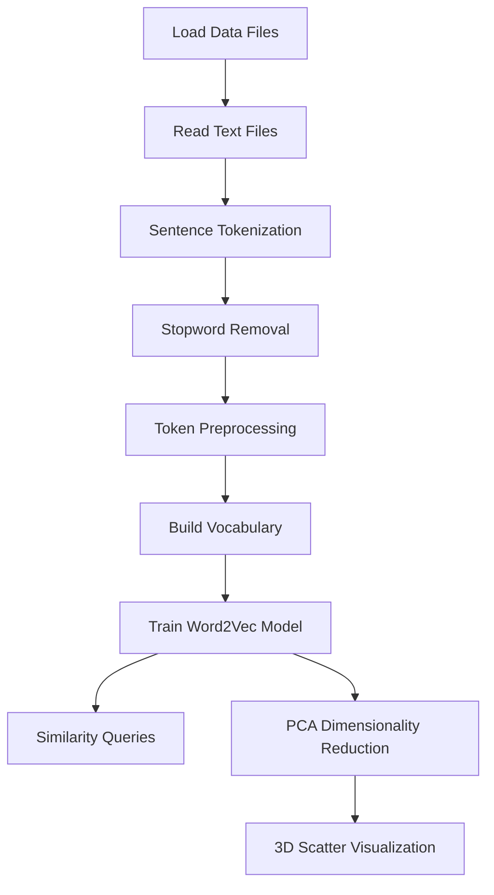

# Game of Thrones Word2Vec Analysis

This notebook trains a Word2Vec model on Game of Thrones text data and performs similarity queries and 3D visualization.

## Workflow

## Pipeline Steps

1. **Data Loading**: Reads all `.txt` files from `data/` directory using `cp1252` encoding to handle Windows-1252 encoded text files

2. **Text Preprocessing**:
   - Sentence tokenization with NLTK's `sent_tokenize`
   - Stopword removal using gensim's `remove_stopwords`
   - Token preprocessing with `simple_preprocess` (lowercase, remove punctuation/numbers)

3. **Model Training**: Word2Vec with `window=10`, `min_count=2`, `workers=4`

4. **Analysis**:
   - Word similarity queries via `model.wv.most_similar()`
   - 3D visualization using PCA-reduced embeddings and Plotly