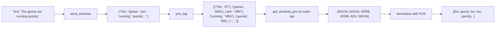
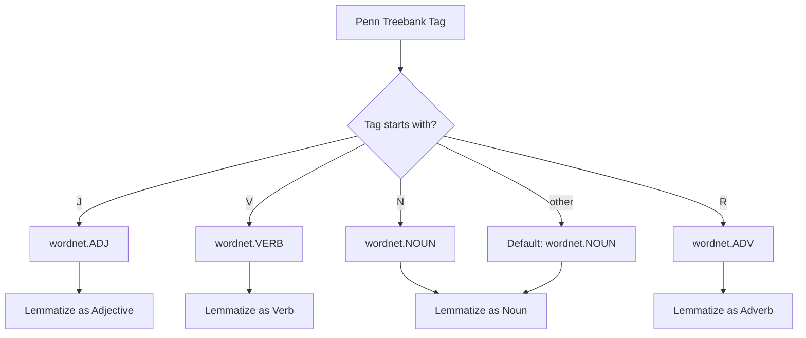

# Day 5: Parts of Speech Tagging and Lemmatization

## Assignment: ass_2.ipynb

This assignment demonstrates how to use NLTK for Parts of Speech (POS) tagging and Lemmatization — two essential text preprocessing techniques in NLP.

---

## 1. Theory

### Parts of Speech (POS) Tagging

Parts of Speech tagging is the process of assigning a grammatical category (part of speech) to each word in a sentence. These categories include nouns, verbs, adjectives, adverbs, determiners, prepositions, pronouns, conjunctions, and more.

POS tagging is a fundamental NLP task that provides syntactic context for words. Modern POS taggers use statistical models trained on annotated corpora. NLTK provides a pre-trained **averaged perceptron tagger** that uses the Penn Treebank tagset.

#### Common Penn Treebank POS Tags

| Tag | Description | Example |
|-----|------------|---------|
| NN | Noun, singular | "dog" |
| NNS | Noun, plural | "dogs" |
| VB | Verb, base form | "run" |
| VBD | Verb, past tense | "ran" |
| VBG | Verb, gerund/present | "running" |
| VBN | Verb, past participle | "run" (as in "has run") |
| VBZ | Verb, 3rd person singular | "runs" |
| JJ | Adjective | "quick" |
| JJR | Adjective, comparative | "quicker" |
| JJS | Adjective, superlative | "quickest" |
| RB | Adverb | "quickly" |
| RBR | Adverb, comparative | "more quickly" |
| DT | Determiner | "the", "a" |
| IN | Preposition | "over", "to" |
| PRP | Personal pronoun | "she", "he" |

### Lemmatization

Lemmatization is the process of reducing a word to its dictionary base form, called a **lemma**. Unlike stemming, which uses heuristic rules to chop off suffixes, lemmatization considers the word's meaning and part of speech to produce a valid dictionary word.

#### Stemming vs Lemmatization

| Word | Stemming (Porter) | Lemmatization |
|------|-------------------|---------------|
| running | run | run |
| geese | gees | goose |
| better | better | good |
| wolves | wolv | wolf |
| studies | studi | study |
| easily | easili | easily |
| computing | comput | compute |

Key differences:
- **Stemming** is faster but produces non-words (over-stems or under-stems)
- **Lemmatization** produces valid dictionary words and requires POS information
- Lemmatization is more accurate but computationally more expensive

### WordNet POS Tags

The WordNet lemmatizer requires WordNet-specific POS tags:
- `wordnet.VERB` — verbs
- `wordnet.NOUN` — nouns
- `wordnet.ADJ` — adjectives
- `wordnet.ADV` — adverbs

Penn Treebank tags must be mapped to WordNet POS tags for accurate lemmatization. By default, WordNet assumes `NOUN` if no POS is specified, which leads to incorrect lemmatization for verbs and adjectives.

---

## 2. Code Explanation

### Imports and Setup

```python
import nltk
from nltk.tokenize import word_tokenize
from nltk import pos_tag
from nltk.stem import WordNetLemmatizer
from nltk.corpus import wordnet
```

- `nltk.tokenize.word_tokenize` splits text into word tokens
- `nltk.pos_tag` assigns Penn Treebank POS tags using the averaged perceptron tagger
- `nltk.stem.WordNetLemmatizer` reduces words to their lemma
- `nltk.corpus.wordnet` provides WordNet POS constants (`wordnet.VERB`, `wordnet.NOUN`, etc.)

The `nltk.download()` calls ensure all required corpora and model files are available.

---

### POS Tagging Demo

```python
text = "The quick brown fox jumps over the lazy dog"
tokens = nltk.word_tokenize(text)
tagged = nltk.pos_tag(tokens)
```

1. `word_tokenize()` splits the sentence into tokens including punctuation
2. `pos_tag()` takes the list of tokens and returns a list of `(word, tag)` tuples using the Penn Treebank tagset

---

### POS Tags Reference Table

A dictionary of common Penn Treebank tags is printed in a formatted table to help understand what each tag represents.

---

### POS Tagging on Multiple Sentences

```python
sentences = [
    "Natural language processing is fascinating.",
    "The students are reading interesting books.",
    "She quickly ran to the store."
]
```

Iterates over multiple sentences, tokenizes each, applies POS tagging, and prints formatted results. Shows how POS tags vary across different grammatical contexts.

---

### Mapping Penn Tags to WordNet Tags

```python
def get_wordnet_pos(treebank_tag):
    if treebank_tag.startswith('J'):
        return wordnet.ADJ
    elif treebank_tag.startswith('V'):
        return wordnet.VERB
    elif treebank_tag.startswith('N'):
        return wordnet.NOUN
    elif treebank_tag.startswith('R'):
        return wordnet.ADV
    else:
        return wordnet.NOUN
```

This mapping function is critical for POS-aware lemmatization:
- Tags starting with `J` are adjectives → `wordnet.ADJ`
- Tags starting with `V` are verbs → `wordnet.VERB`
- Tags starting with `N` are nouns → `wordnet.NOUN`
- Tags starting with `R` are adverbs → `wordnet.ADV`
- All other tags default to `wordnet.NOUN`

Without this mapping, verbs like "running" would not be correctly lemmatized to "run" because the lemmatizer would default to treating them as nouns.

---

### Lemmatization with POS Awareness

```python
lemmatizer = WordNetLemmatizer()
```

Creates a `WordNetLemmatizer` instance. The `.lemmatize()` method accepts a `pos` parameter to specify the word's part of speech, enabling accurate lemmatization across different word categories.

---

### Full Pipeline: Tokenize → POS Tag → Lemmatize

```python
text = "The geese are running quickly to the store."
tokens = nltk.word_tokenize(text)
tagged = nltk.pos_tag(tokens)

lemmatized = []
for word, tag in tagged:
    wn_tag = get_wordnet_pos(tag)
    lemma = lemmatizer.lemmatize(word, pos=wn_tag)
    lemmatized.append(lemma)
```

This demonstrates the complete NLP preprocessing pipeline:
1. Tokenize raw text into word tokens
2. Assign POS tags to each token
3. Map Penn tags to WordNet POS tags
4. Lemmatize each word using its correct POS
5. Collect all lemmas into a list

---

## 3. Program Flowchart

### Overall Pipeline

```mermaid
flowchart TD
    A[Raw Text] --> B{Sentence-Level<br>Tokenization}
    B --> C[List of Sentences]
    C --> D{Word-Level<br>Tokenization}
    D --> E[List of Word Tokens]
    E --> F{POS Tagging<br>pos_tag}
    F --> G[List of (word, tag) tuples]
    G --> H{Map Penn Tags<br>to WordNet POS}
    H --> I{WordNet Lemmatizer<br>lemmatize word with POS}
    I --> J[List of Lemmas]
    J --> K[Output / Display]
```

### Detailed POS Tagging + Lemmatization Flow



### POS Tag → WordNet POS Mapping



---

## 4. Frequently Asked Questions (FAQ)

### Q1: What is the difference between POS tagging and dependency parsing?
**A:** POS tagging assigns a single grammatical category (noun, verb, adjective, etc.) to each word independently. Dependency parsing goes further by identifying grammatical relationships between words (e.g., subject, object, modifier) and produces a tree structure showing how words depend on each other.

### Q2: Why is POS tagging important for lemmatization?
**A:** The WordNet lemmatizer uses POS information to determine the correct base form. Without it, calling `lemmatize("running")` with the default `NOUN` tag returns "running" unchanged, because "running" is a valid noun. Only when you specify `pos=VERB` does it correctly return "run".

### Q3: What is the Penn Treebank tagset?
**A:** The Penn Treebank tagset is a standardized set of 36-45 POS tags used in the Penn Treebank corpus. It is the most widely used tagset in NLP research and practice. NLTK's `pos_tag()` function uses a pre-trained model that predicts Penn Treebank tags.

### Q4: Why does `pos_tag()` return POS-1 tags like `VBG` instead of plain POS like `VERB`?
**A:** Penn Treebank tags provide fine-grained syntactic information. For example, there are multiple verb tags: `VB` (base form), `VBD` (past tense), `VBG` (gerund), `VBN` (past participle), `VBP` (present), and `VBZ` (3rd person singular). This granularity is useful for more precise linguistic analysis than plain POS categories.

### Q5: What happens if no POS mapping is used during lemmatization?
**A:** The `WordNetLemmatizer` defaults to `NOUN` for all tokens when no POS is specified. This means verbs like "running" are NOT lemmatized to "run" (they stay as "running"), adjectives like "better" stay as "better" instead of becoming "good", and only nouns are correctly lemmatized.

### Q6: Is lemmatization always more accurate than stemming?
**A:** Generally yes, lemmatization produces valid dictionary words and is more linguistically correct. However, stemming is significantly faster and requires no POS context. For some applications (e.g., information retrieval), the slight inaccuracy of stemming is acceptable given its speed advantage. The best choice depends on the use case.

### Q7: Can `nltk.pos_tag()` handle multi-word expressions or compound words?
**A:** No, `pos_tag()` operates on individual tokens. Multi-word expressions like "New York" would be tagged separately as NNP (proper noun) for each word. For compound handling, additional preprocessing like noun phrase chunking is needed.

### Q8: What is the `omw-1.4` corpus download needed for?
**A:** The `omw-1.4` (Open Multilingual Wordnet) corpus provides additional lexical coverage for the WordNet lemmatizer across multiple languages. It extends the base WordNet data, allowing lemmatization of words that may not be in the default English WordNet corpus.

### Q9: How does `pos_tag()` determine the correct tag for ambiguous words?
**A:** NLTK's `pos_tag()` uses a pre-trained averaged perceptron model that considers the surrounding context (neighboring words) to disambiguate POS tags. For example, "book" as a noun in "read a book" vs. "book" as a verb in "book a flight". The model was trained on the Penn Treebank corpus and uses contextual features for classification.

### Q10: How can I use POS tagging and lemmatization together in a preprocessing pipeline?
**A:** The recommended approach demonstrated in Cell 13 is:
1. Tokenize the text with `word_tokenize()`
2. Apply `pos_tag()` to get `(word, tag)` tuples
3. Map Penn tags to WordNet POS using `get_wordnet_pos()`
4. Call `lemmatizer.lemmatize(word, pos=wn_tag)` for each token
5. Collect the lemmas for downstream use (e.g., feature extraction, model input)

This pipeline ensures that lemmatization is POS-aware, producing the most accurate results for text classification, sentiment analysis, and other NLP tasks."