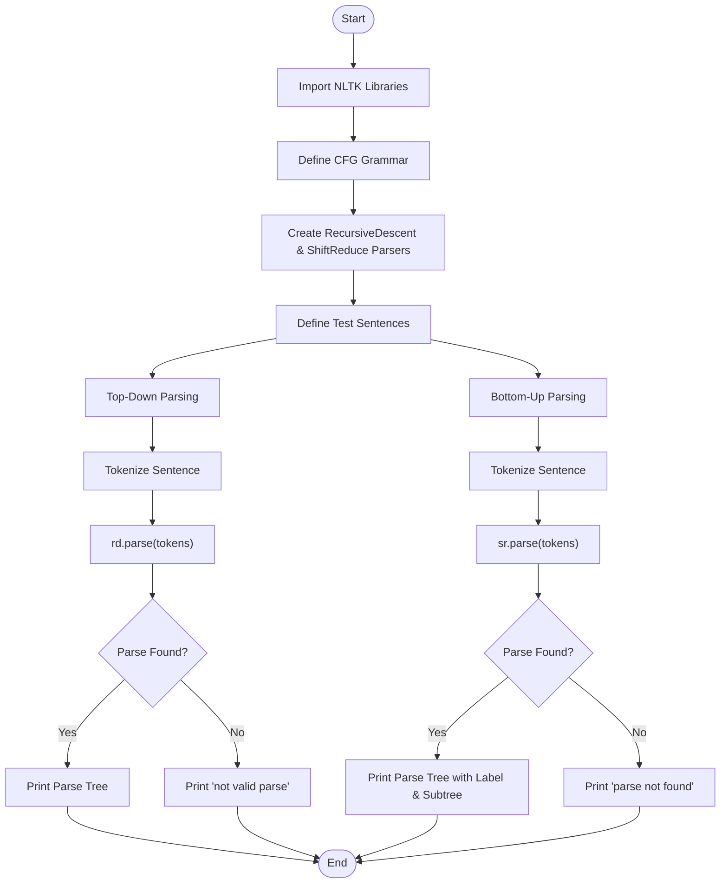
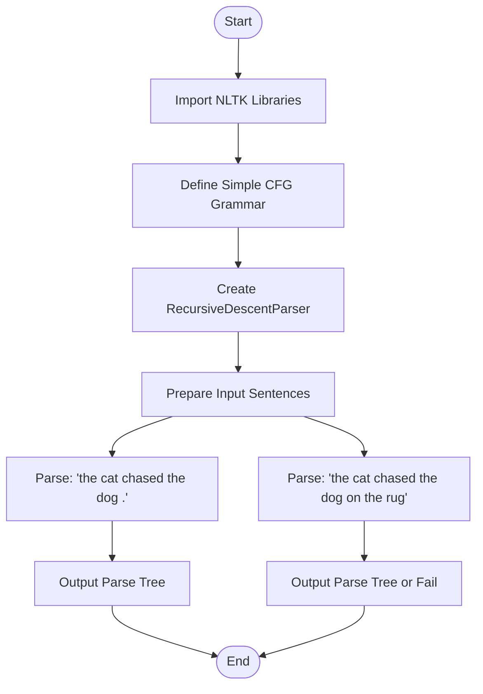
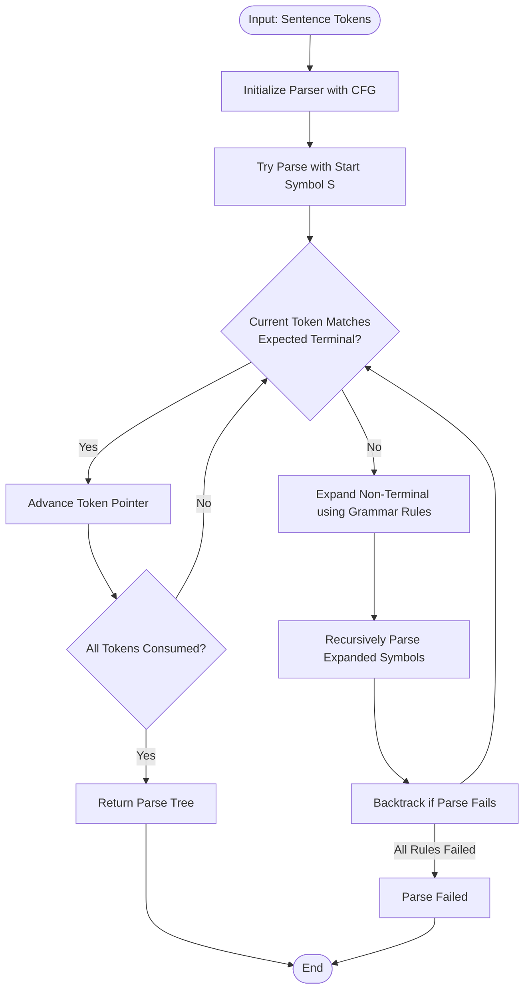
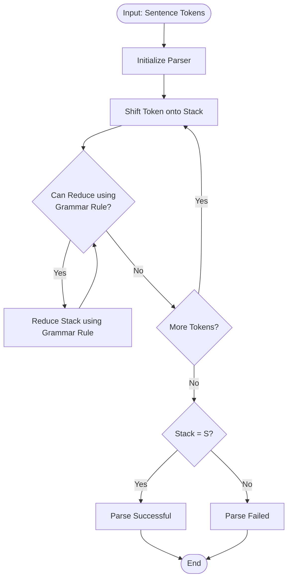

# Day 7: Parsing Techniques - Top-Down & Bottom-Up

## Overview

This repository contains implementations and experiments with **syntactic parsing techniques** used in Natural Language Processing (NLP). Parsing is the process of analyzing a sequence of tokens to determine its grammatical structure with respect to a given formal grammar.

## Theory

### What is Parsing in NLP?

Parsing is the task of analyzing a string of symbols, either in natural language, computer languages or data structures, conforming to the rules of a formal grammar. In NLP, parsing is used to understand the grammatical structure of sentences, which is essential for tasks like:

- Machine translation
- Question answering
- Information extraction
- Speech recognition

### Types of Parsing Techniques

#### 1. Top-Down Parsing (Recursive Descent Parser)

Top-down parsing starts with the **start symbol** (usually `S`) and tries to **rewrite** it into the input string by applying grammar rules. It expands non-terminals until it matches the input tokens.

**Key Characteristics:**

- Starts from the root (start symbol `S`)
- Uses leftmost derivation
- Expands non-terminals recursively
- Works best with **left-factored grammars** (no left recursion)

**NLTK Implementation:**

```python
from nltk.parse import RecursiveDescentParser
rd = RecursiveDescentParser(grammar)
for tree in rd.parse(tokens):
    print(tree)
```

#### 2. Bottom-Up Parsing (Shift-Reduce / Earley Chart Parser)

Bottom-up parsing starts with the **input tokens** and tries to **reduce** them into the start symbol by combining smaller constituents into larger ones.

**Key Characteristics:**

- Starts from the input (leaves)
- Uses rightmost derivation (reversed)
- Combines tokens using grammar rules
- Handles ambiguous grammars better

**NLTK Implementation:**

```python
from nltk.parse import EarleyChartParser
earley = EarleyChartParser(grammar)
for tree in earley.parse(tokens):
    print(tree)
```

### Context-Free Grammar (CFG)

A Context-Free Grammar `G` is defined as a 4-tuple:

```
G = (N, Σ, R, S)
```

Where:

- **N**: Set of non-terminal symbols (e.g., S, NP, VP)
- **Σ**: Set of terminal symbols (e.g., words like "dog", "chased")
- **R**: Set of production rules (e.g., S → NP VP)
- **S**: Start symbol (usually `S`)

### Grammar Used in This Assignment

```grammar
S   → NP VP | NP VP PP
NP  → Det N | Det Adj N
VP  → V NP | V NP PP | V Adj
PP  → P NP
Det → "the" | "a"
Adj → "big" | "small" | "red" | "quick"
N   → "dog" | "cat" | "rug" | "man" | "park"
V   → "chased" | "sat" | "walked" | "saw"
Adv → "quickly" | "slowly"
P   → "in" | "on" | "by" | "with"
```

## Program Flow

### Assignment.ipynb Flow



### Recursive_Descent_Parser.ipynb Flow



### Detailed Algorithm Flow - Top-Down (Recursive Descent)



### Detailed Algorithm Flow - Bottom-Up



## Files

| File                               | Description                                                                                                       |
| ---------------------------------- | ----------------------------------------------------------------------------------------------------------------- |
| `Assignment.ipynb`               | Main assignment implementing top-down and bottom-up parsing on complex sentences with adjectives and prepositions |
| `Recursive_Descent_Parser.ipynb` | Simple recursive descent parser demonstration with basic grammar                                                  |
| `README.md`                      | This documentation file                                                                                           |

## How to Run

1. Install required dependencies:

   ```bash
   pip install nltk
   ```
2. Download required NLTK data:

   ```python
   import nltk
   nltk.download('punkt')
   ```
3. Open the Jupyter notebooks:

   ```bash
   jupyter notebook Assignment.ipynb
   jupyter notebook Recursive_Descent_Parser.ipynb
   ```

## Expected Output

### For `the dog chased the cat`:

```
(S
  (NP (Det the) (N dog))
  (VP (V chased) (NP (Det the) (N cat))))
```

### For `the quick dog saw a red cat`:

```
(S
  (NP (Det the) (Adj quick) (N dog))
  (VP (V saw) (NP (Det a) (Adj red) (N cat))))
```

### For `the big dog sat on the red rug`:

```
(S
  (NP (Det the) (Adj big) (N dog))
  (VP (V sat) (PP (P on) (NP (Det the) (Adj red) (N rug)))))
```

## Viva / Interview Questions

### 1. What is the difference between top-down and bottom-up parsing?

Top-down parsing starts from the start symbol and expands downward using grammar rules, trying to reach the input tokens. Bottom-up parsing starts from the input tokens and combines them upward to reach the start symbol.

### 2. What is a Context-Free Grammar (CFG)?

A CFG is a formal grammar where every production rule is of the form A → α, where A is a single non-terminal symbol and α is a string of terminals and/or non-terminals. It is defined by the 4-tuple (N, Σ, R, S).

### 3. What is Recursive Descent Parsing?

Recursive Descent Parsing is a top-down parsing technique where each non-terminal in the grammar is implemented as a function. The parser tries to match the input by recursively expanding grammar rules.

### 4. What are the limitations of Recursive Descent Parser?

- Cannot handle left-recursive grammars (causes infinite recursion)
- Backtracking can be inefficient
- May not handle ambiguous grammars well without modifications

### 5. What is left recursion and why is it a problem?

Left recursion occurs when a non-terminal appears as the leftmost symbol in its own production rule (e.g., A → A α). It causes infinite recursion in recursive descent parsers because the parser keeps expanding A without consuming input.

### 6. What is the difference between terminal and non-terminal symbols?

Terminal symbols are the actual words/tokens in the language (e.g., "dog", "cat", "chased"). Non-terminal symbols are syntactic variables that represent patterns of terminals (e.g., NP, VP, S).

### 7. What is a parse tree?

A parse tree (or syntax tree) is a tree representation of the syntactic structure of a sentence according to a grammar. The root is the start symbol, internal nodes are non-terminals, and leaves are terminals (words).

### 8. What is backtracking in parsing?

Backtracking is when a parser tries one parsing path, and if it fails, returns to a previous state and tries an alternative path. Recursive descent parsers with backtracking can be inefficient as they may explore many dead ends.

### 9. What is the Earley Chart Parser?

The Earley Chart Parser is a bottom-up parsing algorithm that uses dynamic programming. It builds a chart (table) of all possible parses for each substring, making it efficient and capable of handling all context-free grammars.

### 10. Why do we use CFG in NLP?

CFGs are used in NLP to model the syntactic structure of natural language sentences. They allow us to:

- Generate valid sentences
- Check if a sentence is grammatically correct
- Extract the syntactic structure (parse tree) of sentences
- Support downstream NLP tasks like semantic analysis and machine translation

## Author

Natural Language Processing - Day 7
