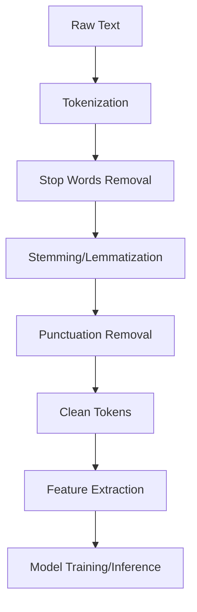
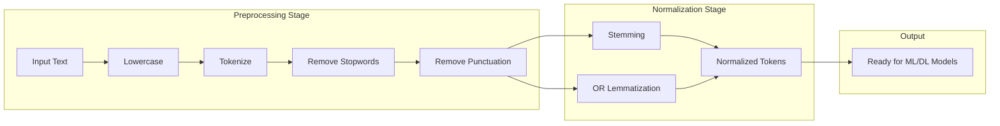
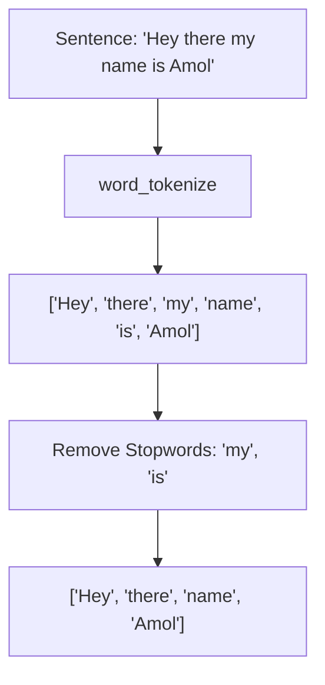
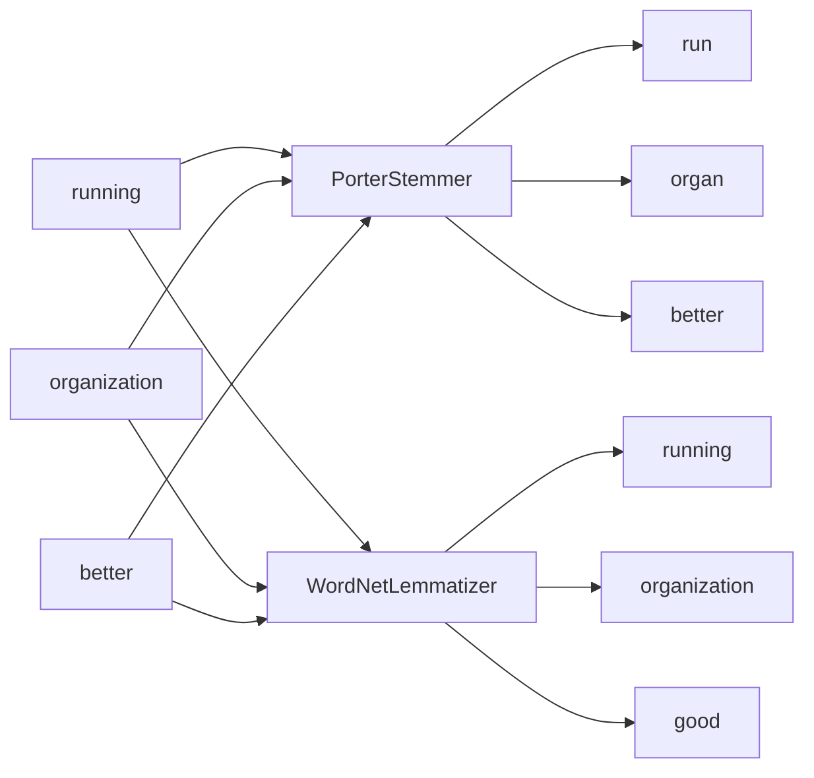
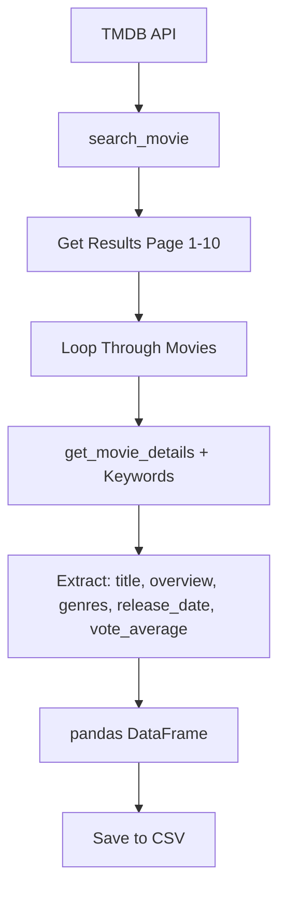

# Natural-Language-Processing-NLP-

## NLP Basics

### What is NLP?
Natural Language Processing (NLP) is a field of artificial intelligence that enables computers to understand, interpret, and manipulate human language. It combines computational linguistics, machine learning, and deep learning to bridge human communication and computational systems.

### Core NLP Concepts

| Concept | Description |
|---------|-------------|
| **Tokenization** | Splitting text into individual units (tokens) such as words, phrases, or sentences |
| **Stop Words** | Common words (e.g., "the", "is", "at") that are often removed to reduce noise |
| **Stemming** | Reducing words to their root/base form using heuristic rules (e.g., "running" → "run") |
| **Lemmatization** | Reducing words to their dictionary form using morphological analysis (e.g., "better" → "good") |
| **Punctuation Removal** | Eliminating punctuation marks from text for cleaner analysis |

## Project Structure

```
NLP/
├── Day_0_Introduction_to_NLP/
│   ├── tokenizer.py           # Text tokenization with NLTK
│   ├── stopwords.py           # Stop word removal demonstration
│   ├── stemming_and_lemmatization.py  # Stem vs Lemma comparison
│   ├── punctuation.py         # Punctuation removal utilities
│   └── practice.py            # Practice exercises
└── Day_1_NLP_Pipeline/
    ├── Text_Processing/
    │   └── data_acquisition.py # TMDB API data fetching and CSV export
    └── Short_Hand/
        └── json_convt.py      # JSON conversion utilities
```

## NLP Pipeline Flowchart



## Text Processing Pipeline



## Tokenization Process



## Stemming vs Lemmatization



## Data Acquisition Pipeline


