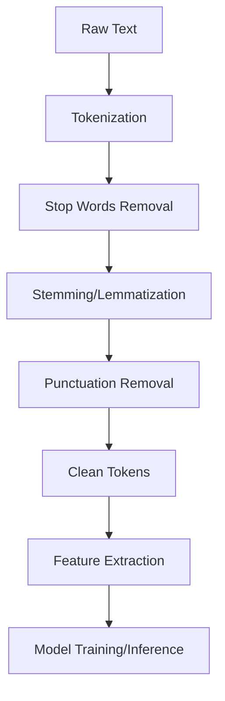
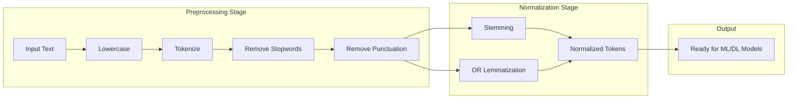
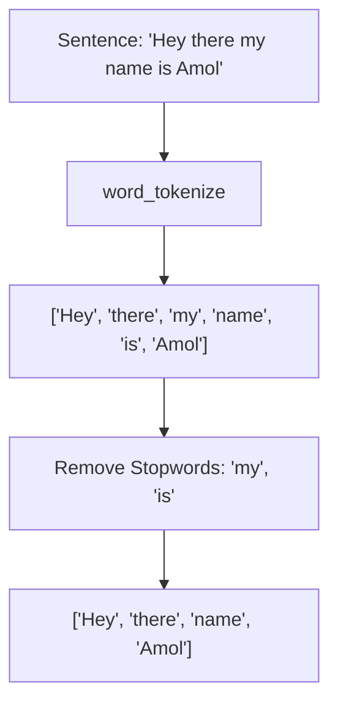
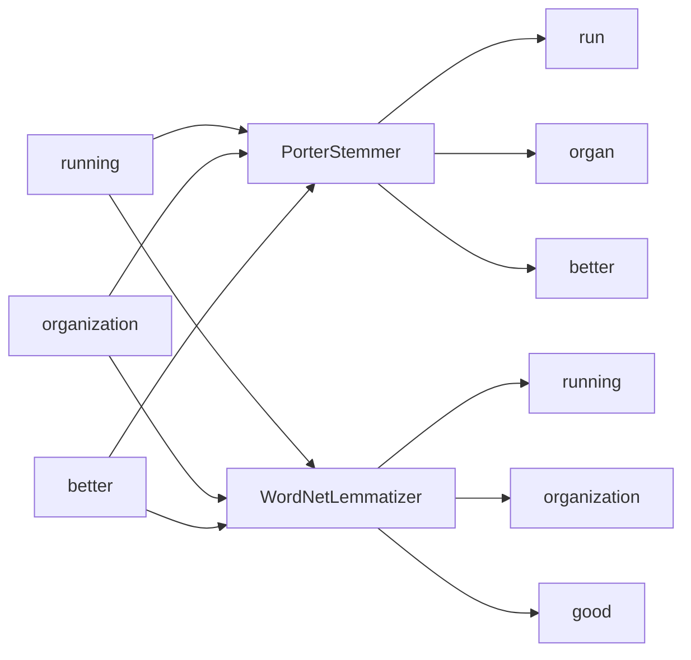
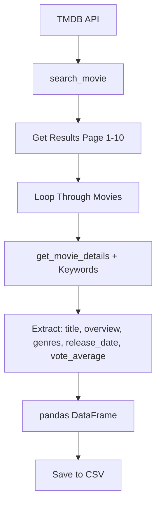

# Natural Language Processing (NLP) Learning Repository

A hands-on, day-wise curriculum and reference collection for learning **Natural Language Processing** with Python. The repository walks through the complete NLP lifecycle — from raw text preprocessing and classical feature extraction to word embeddings, sequence models (RNN/LSTM), and syntactic parsing — using well-known libraries such as **NLTK**, **spaCy**, **gensim**, **scikit-learn**, **PyTorch**, and **TensorFlow/Keras**.

Each module contains runnable Jupyter notebooks, standalone Python scripts, and in-depth Markdown documentation (theory, code walkthroughs, Mermaid flowcharts, and FAQ sections) that make it suitable both for self-study and for classroom/lab assignments.

---

## Table of Contents

- [Project Description](#project-description)
- [Topics Covered](#topics-covered)
- [Repository Structure](#repository-structure)
- [Prerequisites](#prerequisites)
- [Installation](#installation)
- [Usage](#usage)
- [Module Guide](#module-guide)
- [Architecture & NLP Pipeline](#architecture--nlp-pipeline)
- [Configuration & Datasets](#configuration--datasets)
- [Running / Validating the Notebooks](#running--validating-the-notebooks)
- [Contributing](#contributing)
- [License](#license)

---

## Project Description

This repository is an educational NLP toolkit organized as a progressive set of lessons ("Days"). It demonstrates how to turn unstructured text into structured features and predictions:

- **Text preprocessing** — tokenization, stop-word removal, stemming, lemmatization, punctuation/HTML/emoji cleaning, and spelling correction.
- **Feature extraction** — Bag of Words, TF-IDF, and Word2Vec embeddings.
- **Classical ML for text** — text classification using scikit-learn.
- **Deep learning for text** — RNN/LSTM sentiment classification with PyTorch and Keras.
- **Syntactic analysis** — Parts-of-Speech tagging and grammar-based parsing (Recursive Descent, Earley/CKY).
- **Applied case studies** — topic modeling and similarity analysis on real-world-style corpora.

The materials are practical: every concept ships with executable code so you can read, run, and modify it.

---

## Topics Covered

| Module | Theme | Key Libraries |
| ------ | ----- | ------------- |
| Day 0 | Introduction & text preprocessing with NLTK | `nltk` |
| Day 1 | NLP pipeline, data acquisition & noisy-text cleaning | `nltk`, `requests`, `re` |
| Day 2 | Advanced text processing & feature extraction | `nltk`, `scikit-learn` |
| Day 3 | Text classification & Word2Vec (Game of Thrones) | `gensim`, `nltk`, `plotly` |
| Day 4 | Word embeddings: BoW, TF-IDF, Word2Vec | `gensim`, `scikit-learn` |
| Day 5 | Parts-of-Speech tagging & lemmatization | `nltk`, `spacy` |
| Day 6 | Recurrent Neural Networks for NLP | `torch`, `tensorflow`, `scikit-learn` |
| Day 7 | Syntactic parsing (top-down & bottom-up) | `nltk` |
| Assignment | Morphological CKY parsing | Python stdlib |
| Case Study | Smart News — topic modeling & embeddings | `gensim`, `nltk`, `textblob`, `spacy` |

---

## Repository Structure

```
Natural-Language-Processing-NLP-/
├── Day_0_Introduction_to_NLP/
│   ├── README_1.md                      # Theory + FAQ for Day 0
│   ├── ass1.ipynb                       # Assignment: tokenization, stop-words, stemming
│   ├── tokenizer.py                     # Word/sentence tokenization with NLTK
│   ├── stopwords.py                     # Stop-word removal demo
│   ├── stemming_and_lemmatization.py    # Stem vs. lemma comparison
│   ├── punctuation.py                   # Punctuation removal utilities
│   └── practice.py                      # Practice exercises
├── Day_1_NLP_Pipeline/
│   ├── Text_Processing/
│   │   ├── data_acquisition.py          # TMDB API fetch -> CSV export
│   │   ├── text_processing_task.ipynb
│   │   └── tmdb_action_movies.csv
│   ├── IMBD_Case_Study/
│   │   └── Case_1_IMDB.ipynb            # IMDB sentiment case study
│   ├── Short_Hand/
│   │   ├── json_convt.py                # JSON conversion utilities
│   │   └── slang.txt                    # Slang/short-hand dictionary
│   ├── Punctuation_remove.py
│   ├── spelling_correction.ipynb
│   ├── emojis_text_cleaning.ipynb
│   ├── html_text_cleaning.ipynb
│   ├── Task_1_Speeling_Correction.md
│   ├── Task_1_Emoji_Cleaning.md
│   └── Task_1_HTML_Cleaning.md
├── Day_2_Text_Processing/
│   ├── preprocessing.ipynb              # Text preprocessing techniques
│   ├── Feature_Extraction.ipynb         # BoW / TF-IDF / n-grams
│   └── IMDB Dataset.csv
├── Day_3_Text_Classification/
│   ├── word2vec_demo.ipynb              # Word2Vec demonstration
│   ├── Game_of_thrones/
│   │   ├── word2vec.ipynb               # Train Word2Vec on GoT scripts
│   │   ├── document.md                  # Workflow documentation
│   │   └── data/                        # 001ssb.txt … 005ssb.txt
│   └── GoogleNews-vectors-negative300.bin.gz  # Pre-trained Word2Vec model
├── Day_4_Word2Vec/
│   ├── Word2Vec.ipynb                   # Word2Vec implementation
│   ├── Tf-IDF.ipynb                     # TF-IDF vectorization
│   ├── Bag_Of_Words.ipynb               # Bag-of-Words model
│   └── IMDB Dataset.csv
├── Day_5_Parts_of_Speech_Tagging/
│   ├── pos-tagging.ipynb                # POS tagging with spaCy (+ displacy)
│   ├── ass_2.ipynb                      # POS tagging & lemmatization with NLTK
│   └── README_2.md                      # Theory + FAQ for Day 5
├── Day_6_RNN/
│   ├── RNN_Guide_NLP.ipynb              # Interactive RNN guide
│   ├── RNN_Guide_NLP.md                 # Same guide as Markdown
│   ├── rnn_sentiment.py                 # PyTorch RNN sentiment classifier
│   └── Project_RNN/
│       ├── code.ipynb                   # Keras LSTM sentiment project
│       ├── Preprocessing.py             # Text -> padded sequences
│       ├── visualize.py                 # Embedding/result visualization
│       └── word2vec_demo.ipynb
├── Day_7_Parsing/
│   ├── Assignment.ipynb                 # Top-down & bottom-up parsing
│   ├── Recursive_Descent_Parser.ipynb   # Simple recursive descent demo
│   └── README.md                        # Theory + FAQ for Day 7
├── Assignment/
│   └── Assignment5/
│       ├── Assignment5.ipynb            # Morphological CKY parsing
│       ├── NLP_Ass_5.ipynb              # Extended version w/ unary rules
│       └── README.md
├── Case_Study_Smart_News/
│   └── case_study.ipynb                 # Topic modeling & embeddings
├── NLP_Ass_4.ipynb                      # Word2Vec assignment notebook
├── requirement.txt                      # Base Python dependencies
└── README.md                            # This file
```

> **Note:** Large binary assets such as `GoogleNews-vectors-negative300.bin.gz` and `*.csv` datasets are part of the repo (or referenced from it) and are required by the corresponding notebooks. Some datasets may need to be downloaded separately if they are git-ignored.

---

## Prerequisites

- **Python 3.8+** (developed and tested on Python 3.12 in places).
- **pip** package manager.
- (Optional) **Jupyter Notebook / JupyterLab** to run the `.ipynb` files.
- Internet access for:
  - downloading NLTK/spaCy corpora and models,
  - fetching the TMDB dataset in `Day_1_NLP_Pipeline/Text_Processing/data_acquisition.py` (requires a free TMDB API key).

---

## Installation

1. **Clone the repository**

   ```bash
   git clone <your-repo-url> Natural-Language-Processing-NLP-
   cd Natural-Language-Processing-NLP-
   ```

2. **(Recommended) Create and activate a virtual environment**

   ```bash
   python -m venv .venv
   # Windows
   .venv\Scripts\activate
   # macOS / Linux
   source .venv/bin/activate
   ```

3. **Install the base dependencies**

   ```bash
   pip install -r requirement.txt
   ```

   The base `requirement.txt` installs: `pandas`, `scikit-learn`, `matplotlib`, `plotly`, `seaborn`, `gensim`, `nltk`.

4. **Install additional per-module libraries**

   Some modules use libraries not listed in the base file. Install what you need:

   ```bash
   # Day 5 (spaCy POS tagging) + Case Study
   pip install spacy textblob
   python -m spacy download en_core_web_sm

   # Day 1 (TMDB data acquisition)
   pip install requests

   # Day 6 (deep learning) — install ONE of the following (or both)
   pip install torch            # CPU/GPU build, see https://pytorch.org
   pip install tensorflow       # Keras LSTM project
   ```

5. **Download NLTK data**

   Most notebooks call `nltk.download(...)` automatically, but you can pre-fetch the common corpora:

   ```python
   import nltk
   for pkg in ['punkt', 'punkt_tab', 'stopwords', 'wordnet', 'omw-1.4',
               'averaged_perceptron_tagger', 'averaged_perceptron_tagger_eng']:
       nltk.download(pkg)
   ```

---

## Usage

### Running the notebooks

Launch Jupyter from the repository root and open any module:

```bash
jupyter notebook
# or
jupyter lab
```

Then navigate to, for example, `Day_0_Introduction_to_NLP/ass1.ipynb` and run the cells in order.

### Quick start — Day 0 preprocessing (Python script)

```bash
cd Day_0_Introduction_to_NLP
python tokenizer.py
python stopwords.py
python stemming_and_lemmatization.py
python punctuation.py
```

### Running a deep-learning example (Day 6)

```bash
cd Day_6_RNN
python rnn_sentiment.py            # PyTorch RNN sentiment classifier
```

Open `Project_RNN/code.ipynb` in Jupyter to train the Keras LSTM model (uses `Preprocessing.py` and `visualize.py`).

### Fetching the TMDB dataset (Day 1)

`Day_1_NLP_Pipeline/Text_Processing/data_acquisition.py` contains a hardcoded demo API key that may expire or be rate-limited. Replace `TMDB_API_KEY` with your own free key from <https://www.themoviedb.org/settings/api>, then run:

```bash
cd Day_1_NLP_Pipeline/Text_Processing
python data_acquisition.py
```

---

## Module Guide

- **Day 0 — Introduction to NLP:** Fundamentals of text preprocessing (tokenization, stop-words, stemming vs. lemmatization, punctuation removal). See `Day_0_Introduction_to_NLP/README_1.md`.
- **Day 1 — NLP Pipeline:** End-to-end pipeline including data acquisition from the TMDB API, spelling correction, emoji/HTML cleaning, and short-hand/slang normalization.
- **Day 2 — Text Processing:** Preprocessing refinements and classical feature extraction (BoW, TF-IDF, n-grams) on the IMDB dataset.
- **Day 3 — Text Classification & Word2Vec:** Training and querying Word2Vec embeddings; similarity search and 3-D PCA visualization on Game of Thrones scripts.
- **Day 4 — Word Embeddings:** Standalone notebooks comparing Bag of Words, TF-IDF, and Word2Vec.
- **Day 5 — POS Tagging & Lemmatization:** Penn-Treebank POS tagging with spaCy and POS-aware lemmatization with NLTK. See `Day_5_Parts_of_Speech_Tagging/README_2.md`.
- **Day 6 — RNNs:** Math and implementation of RNNs/LSTMs for sentiment analysis (PyTorch + Keras). See `Day_6_RNN/RNN_Guide_NLP.md`.
- **Day 7 — Parsing:** Top-down (Recursive Descent) and bottom-up (Earley/Shift-Reduce) parsing with context-free grammars. See `Day_7_Parsing/README.md`.
- **Assignment 5 — Morphological CKY Parsing:** Bottom-up dynamic-programming parser for morphological analysis in Chomsky Normal Form. See `Assignment/Assignment5/README.md`.
- **Case Study — Smart News:** Topic modeling (LDA) and word-embedding similarity on news-style text using gensim, NLTK, spaCy, and TextBlob.
- **NLP_Ass_4.ipynb:** Word2Vec assignment notebook.

---

## Architecture & NLP Pipeline

The repository follows a standard NLP workflow. Raw text flows through cleaning and normalization stages before being vectorized and passed to a model.

### High-level NLP pipeline


```mermaid
flowchart TD
    A[Raw Text] --> B[Tokenization]
    B --> C[Stop Words Removal]
    C --> D[Stemming/Lemmatization]
    D --> E[Punctuation Removal]
    E --> F[Clean Tokens]
    F --> G[Feature Extraction]
    G --> H[Model Training/Inference]
```

### Text processing pipeline (preprocessing → normalization)


```mermaid
flowchart LR
    subgraph "Preprocessing Stage"
        A[Input Text] --> B[Lowercase]
        B --> C[Tokenize]
        C --> D[Remove Stopwords]
        D --> E[Remove Punctuation]
    end

    subgraph "Normalization Stage"
        E --> F[Stemming]
        E --> G[OR Lemmatization]
        F --> H[Normalized Tokens]
        G --> H
    end

    subgraph "Output"
        H --> I[Ready for ML/DL Models]
    end
```

### Tokenization example


```mermaid
flowchart TD
    A["Sentence: 'Hey there my name is Amol'"] --> B[word_tokenize]
    B --> C["['Hey', 'there', 'my', 'name', 'is', 'Amol']"]
    C --> D["Remove Stopwords: 'my', 'is'"]
    D --> E["['Hey', 'there', 'name', 'Amol']"]
```

### Stemming vs. Lemmatization


```mermaid
flowchart LR
    A[running] --> B[PorterStemmer]
    A --> C[WordNetLemmatizer]
    B --> D[run]
    C --> E[running]

    F[organization] --> B
    F --> C
    B --> G[organ]
    C --> H[organization]

    I[better] --> B
    I --> C
    B --> J[better]
    C --> K[good]
```

### Data acquisition pipeline (Day 1)


```mermaid
flowchart TD
    A[TMDB API] --> B[search_movie]
    B --> C[Get Results Page 1-10]
    C --> D[Loop Through Movies]
    D --> E[get_movie_details + Keywords]
    E --> F[Extract: title, overview, genres, release_date, vote_average]
    F --> G[pandas DataFrame]
    G --> H[Save to CSV]
```

---

## Configuration & Datasets

- **TMDB API key:** `Day_1_NLP_Pipeline/Text_Processing/data_acquisition.py` ships with a placeholder/demo key. Replace it with your own key before running, and respect TMDB rate limits (the script already sleeps between requests).
- **Pre-trained embeddings:** `Day_3_Text_Classification/GoogleNews-vectors-negative300.bin.gz` is a large file used for similarity demos. If absent, train a model from the included `Game_of_thrones/data/*.txt` files instead.
- **Datasets:** `IMDB Dataset.csv` (Day 2 / Day 4) and `tmdb_action_movies.csv` (Day 1) are used directly by the notebooks. Ensure they sit next to the notebooks that reference them.
- **spaCy model:** Day 5 and the Case Study require `python -m spacy download en_core_web_sm`.

---

## Running / Validating the Notebooks

This repository is a learning collection rather than a unit-tested library, so there is no automated test suite. To validate that everything works:

1. Complete the [Installation](#installation) steps.
2. Open each notebook in Jupyter and run **all cells** (`Kernel → Restart Kernel and Run All Cells`).
3. For the standalone scripts, run them directly with `python <script>.py` and confirm they print cleaned/normalized output without errors.
4. For the deep-learning modules (Day 6), confirm the training loop runs and prints loss/accuracy for a few epochs.

If you add new examples, keep the existing documentation style: pair each notebook with a short Markdown file (theory + FAQ) and a Mermaid flowchart where helpful.

---

## Contributing

Contributions that improve explanations, fix bugs, or add new NLP modules are welcome.

1. Fork the repository and create a feature branch (`git checkout -b feature/my-improvement`).
2. Follow the existing structure: put new lessons in a `Day_N_*` folder, include a notebook and (optionally) a `README_N.md` with theory, flowcharts, and FAQs.
3. Update `requirement.txt` if you introduce new Python dependencies.
4. Keep code commented and notebooks executable top-to-bottom.
5. Open a pull request describing your changes.

---

## License

This repository is intended for educational use. Check with the repository owner before redistributing datasets or pre-trained model files. Individual notebooks/scripts are provided as-is for learning purposes.
